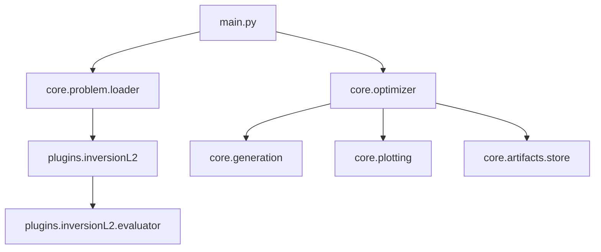

# Project Context Pack: ParetoMetaDecision

## Project Tree
```
ParetoMetaDecision/
├── cache
│   ├── audit
│   │   ├── language_sentences
│   │   │   └── v1
│   │   │       └── summary.json
│   │   └── pattern_events
│   │       └── v1
│   ├── core
│   │   └── _global_
│   │       └── language_registry
│   │           └── ast
│   │               └── v1
│   └── investment
│       └── 3fcac2003207982f317c9c5bdf2e1f86ef979d7badb276f392bf9676941aa21b-v1
│           └── forward_returns
│               └── v1
├── config
│   └── system.yaml
├── core
│   ├── artifacts
│   │   ├── __init__.py
│   │   ├── decision_event_logger.py
│   │   ├── hash.py
│   │   ├── pattern_event_logger.py
│   │   └── store.py
│   ├── decision_language
│   │   ├── __init__.py
│   │   ├── adapter.py
│   │   ├── ast.py
│   │   ├── constraints.py
│   │   └── registry.py
│   ├── decision_models
│   │   ├── baselines.py
│   │   └── expected_value.py
│   ├── generation
│   │   ├── base.py
│   │   ├── combinatorial.py
│   │   ├── discovery_guided.py
│   │   ├── flat_product.py
│   │   └── sentence_ledger.py
│   ├── governance
│   │   ├── __init__.py
│   │   └── decision_schedule.py
│   ├── optimizers
│   │   ├── base.py
│   │   ├── bayesian.py
│   │   ├── factory.py
│   │   ├── grid.py
│   │   ├── nsga2.py
│   │   ├── random.py
│   │   └── registry.py
│   ├── policies
│   │   ├── base.py
│   │   ├── factory.py
│   │   └── logic.py
│   ├── problem
│   │   ├── __init__.py
│   │   ├── base.py
│   │   ├── loader.py
│   │   ├── registry.py
│   │   └── spec.py
│   ├── utils
│   │   ├── imports.py
│   │   └── yaml_io.py
│   ├── __init__.py
│   ├── context.py
│   ├── contracts.py
│   ├── contracts_decision_audit.py
│   ├── live_pareto_plot.py
│   ├── optimization_tracker.py
│   ├── optimizer.py
│   ├── pareto.py
│   ├── plotting.py
│   ├── snapshot.py
│   └── utility.py
├── data
│   └── raw
│       ├── MES.csv
│       ├── MES_3.csv
│       └── MES_4.csv
├── plugins
│   ├── inversionL2
│   │   ├── policies
│   │   │   ├── __init__.py
│   │   │   └── rule_1_vectorized.py
│   │   ├── __init__.py
│   │   ├── data_loader.py
│   │   ├── dataset.yaml
│   │   ├── domain.yaml
│   │   ├── evaluator.py
│   │   └── problem_factory.py
│   └── patternDiscoveryL2
│       ├── __init__.py
│       ├── domain.yaml
│       ├── evaluator.py
│       └── problem_factory.py
├── tools
│   └── mapa_audit.py
├── generar_arbol_jerarquia.py
├── generar_arbol_jerarquia_detallado.py
├── jupyter_test.ipynb
├── jupyter_test_governance.yaml
├── main.py
├── mapa_audit.json
├── mapa_audit_table.csv
├── pareto_live.html
├── project_context.md
├── project_overview.md
├── risk_benefit_live.html
└── System_Jerarquy.png
```

## File Index (summaries)
- `main.py` (13107 bytes)
- `cache\audit\language_sentences\v1\summary.json` (161765 bytes)
- `config\system.yaml` (181 bytes)
- `core\__init__.py` (0 bytes)
- `core\artifacts\__init__.py` (149 bytes)
- `core\artifacts\decision_event_logger.py` (2245 bytes)
- `core\artifacts\hash.py` (797 bytes)
- `core\artifacts\pattern_event_logger.py` (1502 bytes)
- `core\artifacts\store.py` (2975 bytes)
- `core\context.py` (272 bytes)
- `core\contracts.py` (780 bytes)
- `core\contracts_decision_audit.py` (423 bytes)
- `core\decision_language\__init__.py` (151 bytes)
- `core\decision_language\adapter.py` (3279 bytes)
- `core\decision_language\ast.py` (4732 bytes)
- `core\decision_language\constraints.py` (872 bytes)
- `core\decision_language\registry.py` (3506 bytes)
- `core\decision_models\baselines.py` (207 bytes)
- `core\decision_models\expected_value.py` (430 bytes)
- `core\generation\base.py` (626 bytes)
- `core\generation\combinatorial.py` (877 bytes)
- `core\generation\discovery_guided.py` (7981 bytes)
- `core\generation\flat_product.py` (1154 bytes)
- `core\generation\sentence_ledger.py` (518 bytes)
- `core\governance\__init__.py` (0 bytes)
- `core\governance\decision_schedule.py` (2099 bytes)
- `core\live_pareto_plot.py` (8333 bytes)
- `core\optimization_tracker.py` (1094 bytes)
- `core\optimizer.py` (15725 bytes)
- `core\optimizers\base.py` (265 bytes)
- `core\optimizers\bayesian.py` (0 bytes)
- `core\optimizers\factory.py` (2318 bytes)
- `core\optimizers\grid.py` (5739 bytes)
- `core\optimizers\nsga2.py` (11259 bytes)
- `core\optimizers\random.py` (836 bytes)
- `core\optimizers\registry.py` (441 bytes)
- `core\pareto.py` (1111 bytes)
- `core\plotting.py` (3408 bytes)
- `core\policies\base.py` (328 bytes)
- `core\policies\factory.py` (509 bytes)
- `core\policies\logic.py` (814 bytes)
- `core\problem\__init__.py` (123 bytes)
- `core\problem\base.py` (576 bytes)
- `core\problem\loader.py` (726 bytes)
- `core\problem\registry.py` (1927 bytes)
- `core\problem\spec.py` (1510 bytes)
- `core\snapshot.py` (1697 bytes)
- `core\utility.py` (825 bytes)
- `core\utils\imports.py` (389 bytes)
- `core\utils\yaml_io.py` (276 bytes)
- `data\raw\MES.csv` (5077275 bytes)
- `data\raw\MES_3.csv` (118605628 bytes)
- `data\raw\MES_4.csv` (41254602 bytes)
- `generar_arbol_jerarquia.py` (3746 bytes)
- `generar_arbol_jerarquia_detallado.py` (17116 bytes)
- `jupyter_test.ipynb` (1681164 bytes)
- `jupyter_test_governance.yaml` (2066 bytes)
- `mapa_audit.json` (87472 bytes)
- `mapa_audit_table.csv` (0 bytes)
- `pareto_live.html` (42224 bytes)
- `plugins\inversionL2\__init__.py` (0 bytes)
- `plugins\inversionL2\data_loader.py` (5111 bytes)
- `plugins\inversionL2\dataset.yaml` (559 bytes)
- `plugins\inversionL2\domain.yaml` (2609 bytes)
- `plugins\inversionL2\evaluator.py` (23192 bytes)
- `plugins\inversionL2\policies\__init__.py` (0 bytes)
- `plugins\inversionL2\policies\rule_1_vectorized.py` (1036 bytes)
- `plugins\inversionL2\problem_factory.py` (3417 bytes)
- `plugins\patternDiscoveryL2\__init__.py` (0 bytes)
- `plugins\patternDiscoveryL2\domain.yaml` (4127 bytes)
- `plugins\patternDiscoveryL2\evaluator.py` (18156 bytes)
- `plugins\patternDiscoveryL2\problem_factory.py` (2718 bytes)
- `project_context.md` (167585 bytes)
- `project_overview.md` (2603 bytes)
- `risk_benefit_live.html` (42241 bytes)
- `System_Jerarquy.png` (12730 bytes)
- `tools\mapa_audit.py` (26263 bytes)

## File Details

### `main.py`

**Head snippet:**
```
# main.py
from __future__ import annotations

import json
import math
import pandas as pd
import yaml

from core.plotting import show_utility_diagram
from core.optimizer import optimize_parameters
from core.utility import UtilitySpec

from core.problem.loader import load_problem_from_domain_yaml

import inspect
from core.problem.loader import load_problem_from_domain_yaml as f_loader

print("DBG import core.problem:", load_problem_from_domain_yaml, load_problem_from_domain_yaml.__module__)
print("DBG import core.problem.loader:", f_loader, f_loader.__module__)
print("DBG same object?:", load_problem_from_domain_yaml is f_loader)

def load_yaml(path: str) -> dict:
    with open(path, "r", encoding="utf-8") as f:
        return yaml.safe_load(f) or {}


def evaluate_single_configuration(problem: Problem, params: dict, ctx: dict) -> dict:
    return problem.evaluate(params, ctx)


def verify_optimization(
    *,
    evaluated: list,
    best: dict,
    problem: Problem,
    domain_cfg: dict,
    pareto_axes: tuple,
    ctx: dict,
) -> None:
    """
    Verifica que la optimización está funcionando correctamente:
      1) best maximiza utility
      2) métricas presentes y no None / no NaN
      3) re-eval determinista del best (coincidencia en métricas estables)
      4) no hay params duplicados evaluados (dedup efectivo)
    Lanza AssertionError si algo falla.
    """

    # 1) best == max(utility) (MapA-9: solo candidatos valid=True compiten)
    def _metrics(rec: dict) -> dict:
        return rec.get("metrics") if isinstance(rec.get("metrics"), dict) else rec

    valid_recs = []
    for x in evaluated:
        m = _metrics(x)
        if m.get("valid", True):
            valid_recs.append(x)

    assert valid_recs, "No hay candidatos valid=True en evaluated (todo invalid/no_support)"

    utilities = []
    for x in valid_recs:
        m = _metrics(x)
        utilities.append(float(m["utility"]) if m.get("utility") is not None else float("-inf"))

    best_m = _metrics(best)
    assert best_m.get("valid", True), "best es invalid (MapA-9: best debe ser valid=True)"
    assert best_m.get("utility") is not None, "best.utility es None"

    assert float(best_m["utility"]) == max(utilities), "BEST no coincide con el máximo de utility (valid=True)"
    print("OK(1): best == max(utility) sobre valid=True")

    # 2) Invariantes de métricas (MapA-9)
    required = tuple(domain_cfg.get("validation", {}).get("required_metrics", ["utility"]))

    for i, x in enumerate(evaluated, start=1):
        # métricas pueden estar planas o dentro de "metrics"
        #m = x.get("metrics") if isinstance(x.get("metrics"), dict) else x
        m = _metrics(x)

        # --- Contrato MapA-9: valid puede no estar en required_metrics, pero lo usamos si existe
        valid = m.get("valid", True)

        # A) Caso INVALIDO: se permite None en métricas "predictivas"
        if not valid:
            # Invariantes mínimas para inválidos
            assert "support" in m, f"Falta 'support' en evaluated[{i}] (invalid)"
            assert float(m.get("support", 0.0)) == 0.0 or m.get("reason") in (
                "governance_violation",
                "not_enough_points",
                "no_support",
            ), f"Invalid sin support==0 ni reason esperada en evaluated[{i}]"

            # Si existen ppv/recall, deben ser None (no evaluables)
            reason = m.get("reason", "unknown")

            # En inválidos hay dos familias:
            # - no_support / not_enough_points: puede NO haber métricas (None)
            # - governance_violation: puede haber métricas calculadas, pero se rechaza por política
            if reason in ("no_support", "not_enough_points"):
                if "ppv" in m:
                    assert m["ppv"] is None or float(m["ppv"]) == 0.0, f"ppv debe ser None/0 en {reason} evaluated[{i}]"
                if "recall" in m:
                    assert m["recall"] is None or float(m["recall"]) == 0.0, f"recall debe ser None/0 en {reason} evaluated[{i}]"

            elif reason == "governance_violation":
                # Se permiten métricas numéricas (de hecho ayudan a diagnosticar por qué falla)
                # Solo exigimos que existan los campos de gobernanza
                assert "support" in m, f"Falta support en governance_violation evaluated[{i}]"
                # opcional: si quieres, aseguras que realmente viola algo mínimo
                # (pero esto depende de tu implementación)
                pass

            else:
                # Unknown invalid reason: no rompemos, pero lo dejamos señalado
                # Puedes endurecer esto cuando cierres contrato.
                pass


            # Utility puede ser sentinela (-1e9) o None; no forzamos.
```

### `cache\audit\language_sentences\v1\summary.json`

**Head snippet:**
```
{
  "ATOM(order_imbalance|(('k', 1), ('theta', 0.001)))": {
    "sentence": "order_imbalance(k=1, theta=0.001)",
    "states": [
      "draft"
    ],
    "horizons": [
      1
    ],
    "n_events": 1,
    "violations_counts": {},
    "max_ast_size": 1,
    "max_ast_depth": 1
  },
  "ATOM(order_imbalance|(('k', 2), ('theta', 0.001)))": {
    "sentence": "order_imbalance(k=2, theta=0.001)",
    "states": [
      "draft"
    ],
    "horizons": [
      1
    ],
    "n_events": 1,
    "violations_counts": {},
    "max_ast_size": 1,
    "max_ast_depth": 1
  },
  "ATOM(order_imbalance|(('k', 3), ('theta', 0.001)))": {
    "sentence": "order_imbalance(k=3, theta=0.001)",
    "states": [
      "draft"
    ],
    "horizons": [
      1
    ],
    "n_events": 1,
    "violations_counts": {},
    "max_ast_size": 1,
    "max_ast_depth": 1
  },
  "ATOM(order_imbalance|(('k', 4), ('theta', 0.001)))": {
    "sentence": "order_imbalance(k=4, theta=0.001)",
    "states": [
      "draft"
    ],
    "horizons": [
      1
    ],
    "n_events": 1,
    "violations_counts": {},
    "max_ast_size": 1,
    "max_ast_depth": 1
  },
  "ATOM(order_imbalance|(('k', 1), ('theta', 0.005)))": {
    "sentence": "order_imbalance(k=1, theta=0.005)",
    "states": [
      "draft"
    ],
    "horizons": [
      1
    ],
    "n_events": 1,
    "violations_counts": {},
    "max_ast_size": 1,
    "max_ast_depth": 1
  },
  "ATOM(order_imbalance|(('k', 2), ('theta', 0.005)))": {
    "sentence": "order_imbalance(k=2, theta=0.005)",
    "states": [
      "draft"
    ],
    "horizons": [
      1
    ],
    "n_events": 1,
    "violations_counts": {},
    "max_ast_size": 1,
    "max_ast_depth": 1
  },
  "ATOM(order_imbalance|(('k', 3), ('theta', 0.005)))": {
    "sentence": "order_imbalance(k=3, theta=0.005)",
    "states": [
      "draft"
    ],
    "horizons": [
      1
    ],
    "n_events": 1,
    "violations_counts": {},
    "max_ast_size": 1,
    "max_ast_depth": 1
  },
  "ATOM(order_imbalance|(('k', 4), ('theta', 0.005)))": {
    "sentence": "order_imbalance(k=4, theta=0.005)",
    "states": [
      "draft"
    ],
    "horizons": [
      1
    ],
    "n_events": 1,
    "violations_counts": {},
    "max_ast_size": 1,
    "max_ast_depth": 1
  },
  "ATOM(order_imbalance|(('k', 1), ('theta', 0.01)))": {
    "sentence": "order_imbalance(k=1, theta=0.01)",
    "states": [
      "draft"
    ],
    "horizons": [
      1
    ],
    "n_events": 1,
    "violations_counts": {},
    "max_ast_size": 1,
    "max_ast_depth": 1
  },
  "ATOM(order_imbalance|(('k', 2), ('theta', 0.01)))": {
    "sentence": "order_imbalance(k=2, theta=0.01)",
    "states": [
      "draft"
    ],
    "horizons": [
      1
    ],
    "n_events": 1,
    "violations_counts": {},
    "max_ast_size": 1,
    "max_ast_depth": 1
  },
  "ATOM(order_imbalance|(('k', 3), ('theta', 0.01)))": {
    "sentence": "order_imbalance(k=3, theta=0.01)",
    "states": [
      "draft"
    ],
    "horizons": [
      1
    ],
    "n_events": 1,
    "violations_counts": {},
    "max_ast_size": 1,
    "max_ast_depth": 1
  },
  "ATOM(order_imbalance|(('k', 4), ('theta', 0.01)))": {
    "sentence": "order_imbalance(k=4, theta=0.01)",
    "states": [
      "draft"
    ],
    "horizons": [
      1
    ],
    "n_events": 1,
    "violations_counts": {},
    "max_ast_size": 1,
    "max_ast_depth": 1
  },
  "ATOM(order_imbalance|(('k', 1), ('theta', 0.02)))": {
    "sentence": "order_imbalance(k=1, theta=0.02)",
    "states": [
      "draft"
    ],
    "horizons": [
      1
    ],
    "n_events": 1,
    "violations_counts": {},
    "max_ast_size": 1,
    "max_ast_depth": 1
  },
  "ATOM(order_imbalance|(('k', 2), ('theta', 0.02)))": {
    "sentence": "order_imbalance(k=2, theta=0.02)",
    "states": [
      "draft"
    ],
    "horizons": [
      1
    ],
    "n_events": 1,
    "violations_counts": {},
    "max_ast_size": 1,
    "max_ast_depth": 1
  },
  "ATOM(order_imbalance|(('k', 3), ('theta', 0.02)))": {
    "sentence": "order_imbalance(k=3, theta=0.02)",
    "states": [
      "draft"
    ],
    "horizons": [
      1
    ],
    "n_events": 1,
    "violations_counts": {},
    "max_ast_size": 1,
    "max_ast_depth": 1
  },
  "ATOM(order_imbalance|(('k', 4), ('theta', 0.02)))": {
    "sentence": "order_imbalance(k=4, theta=0.02)",
    "states": [
      "draft"
```

### `config\system.yaml`

**YAML top keys (approx):** system, mode, data, optimizer

**Head snippet:**
```
system:
  name: ParetoMetaDecision
  version: 0.1.0

mode: development
data:
    file: data/raw/MES.csv
optimizer:
  type: grid     # grid | random | nsga2
  max_evals: 500
```

### `core\__init__.py`

### `core\artifacts\__init__.py`

**Imports:**

- from core.artifacts.store import ArtifactKey, ArtifactStore
- from core.artifacts.hash import hash_file, stable_json_dumps, sha256_str, sha256_bytes

**Head snippet:**
```
from core.artifacts.store import ArtifactKey, ArtifactStore
from core.artifacts.hash import hash_file, stable_json_dumps, sha256_str, sha256_bytes
```

### `core\artifacts\decision_event_logger.py`

**Imports:**

- from __future__ import annotations
- json
- os
- from dataclasses import dataclass
- from datetime import datetime, timezone
- from pathlib import Path
- from typing import Any, Dict, Optional

**Classes:**

- `DecisionEventLoggerConfig`
- `DecisionEventLogger`
  - doc: Append-only JSONL logger para auditoría de decisiones por snapshot (MapA 9).
  - methods:
    - `__init__(self, cfg)`
    - `write_run_meta(self, meta)`
    - `log(self, event)`
    - `close(self)`
    - `__enter__(self)`
    - `__exit__(self, exc_type, exc, tb)`

**Functions:**

- `_utc_iso(ts)`

**Head snippet:**
```
# core/artifacts/decision_event_logger.py
from __future__ import annotations

import json
import os
from dataclasses import dataclass
from datetime import datetime, timezone
from pathlib import Path
from typing import Any, Dict, Optional


def _utc_iso(ts: Optional[datetime] = None) -> str:
    dt = ts or datetime.now(timezone.utc)
    return dt.isoformat(timespec="milliseconds").replace("+00:00", "Z")


@dataclass(frozen=True)
class DecisionEventLoggerConfig:
    root_dir: str = "cache/audit/decision_events/v1"
    events_filename: str = "decision_events.jsonl"
    meta_filename: str = "run_meta.json"
    flush_every: int = 2000


class DecisionEventLogger:
    """
    Append-only JSONL logger para auditoría de decisiones por snapshot (MapA 9).
    """

    def __init__(self, cfg: DecisionEventLoggerConfig):
        self.cfg = cfg
        self.root = Path(cfg.root_dir)
        self.root.mkdir(parents=True, exist_ok=True)

        self.events_path = self.root / cfg.events_filename
        self.meta_path = self.root / cfg.meta_filename

        self._fh = open(self.events_path, "a", encoding="utf-8")
        self._n = 0

    def write_run_meta(self, meta: Dict[str, Any]) -> None:
        meta = dict(meta)
        meta.setdefault("written_at_utc", _utc_iso())
        with open(self.meta_path, "w", encoding="utf-8") as f:
            json.dump(meta, f, ensure_ascii=False, indent=2, sort_keys=True)

    def log(self, event: Dict[str, Any]) -> None:
        event = dict(event)
        event.setdefault("logged_at_utc", _utc_iso())
        self._fh.write(json.dumps(event, ensure_ascii=False) + "\n")
        self._n += 1
        if self.cfg.flush_every > 0 and (self._n % self.cfg.flush_every == 0):
            self._fh.flush()
            os.fsync(self._fh.fileno())

    def close(self) -> None:
        try:
            self._fh.flush()
            os.fsync(self._fh.fileno())
        except Exception:
            pass
        try:
            self._fh.close()
        except Exception:
            pass

    def __enter__(self) -> "DecisionEventLogger":
        return self

    def __exit__(self, exc_type, exc, tb) -> None:
        self.close()
```

### `core\artifacts\hash.py`

**Imports:**

- from __future__ import annotations
- hashlib
- json
- from typing import Any, Dict

**Functions:**

- `stable_json_dumps(d)`
- `sha256_str(s)`
- `sha256_bytes(b)`
- `hash_file(path, chunk_size)`

**Head snippet:**
```
# core/artifacts/hash.py
from __future__ import annotations
import hashlib
import json
from typing import Any, Dict


def stable_json_dumps(d: Dict[str, Any]) -> str:
    """
    Deterministic JSON for hashing keys/params.
    """
    return json.dumps(d, sort_keys=True, separators=(",", ":"), ensure_ascii=False)


def sha256_str(s: str) -> str:
    return hashlib.sha256(s.encode("utf-8")).hexdigest()


def sha256_bytes(b: bytes) -> str:
    return hashlib.sha256(b).hexdigest()


def hash_file(path: str, chunk_size: int = 1024 * 1024) -> str:
    h = hashlib.sha256()
    with open(path, "rb") as f:
        while True:
            chunk = f.read(chunk_size)
            if not chunk:
                break
            h.update(chunk)
    return h.hexdigest()
```

### `core\artifacts\pattern_event_logger.py`

**Imports:**

- from __future__ import annotations
- from dataclasses import dataclass
- from pathlib import Path
- json
- from typing import Any, Dict, Optional

**Classes:**

- `PatternEventLoggerConfig`
- `PatternEventLogger`
  - methods:
    - `__init__(self, cfg)`
    - `__enter__(self)`
    - `__exit__(self, exc_type, exc, tb)`
    - `write_run_meta(self, meta)`
    - `log(self, event)`

**Head snippet:**
```
# core/artifacts/pattern_event_logger.py
from __future__ import annotations

from dataclasses import dataclass
from pathlib import Path
import json
from typing import Any, Dict, Optional


@dataclass(frozen=True)
class PatternEventLoggerConfig:
    root_dir: str = "cache/audit/pattern_events/v1"
    filename: str = "pattern_events.jsonl"
    meta_filename: str = "run_meta.json"


class PatternEventLogger:
    def __init__(self, cfg: PatternEventLoggerConfig):
        self.cfg = cfg
        self._fh = None
        self._meta_written = False

    def __enter__(self) -> "PatternEventLogger":
        Path(self.cfg.root_dir).mkdir(parents=True, exist_ok=True)
        path = Path(self.cfg.root_dir) / self.cfg.filename
        self._fh = open(path, "a", encoding="utf-8")
        return self

    def __exit__(self, exc_type, exc, tb) -> None:
        if self._fh:
            self._fh.close()
            self._fh = None

    def write_run_meta(self, meta: Dict[str, Any]) -> None:
        if self._meta_written:
            return
        path = Path(self.cfg.root_dir) / self.cfg.meta_filename
        with open(path, "w", encoding="utf-8") as f:
            json.dump(meta, f, ensure_ascii=False, indent=2)
        self._meta_written = True

    def log(self, event: Dict[str, Any]) -> None:
        if not self._fh:
            raise RuntimeError("PatternEventLogger not opened")
        self._fh.write(json.dumps(event, ensure_ascii=False) + "\n")
```

### `core\artifacts\store.py`

**Imports:**

- from __future__ import annotations
- from dataclasses import dataclass
- from pathlib import Path
- from typing import Any, Callable, Dict, Optional
- pickle
- os
- json
- from core.artifacts.hash import stable_json_dumps, sha256_str

**Classes:**

- `ArtifactKey`
  - doc: Generic key for any intermediate artifact.
  - methods:
    - `params_hash(self)`
- `ArtifactStore`
  - doc: Filesystem-backed generic artifact store.
  - methods:
    - `__init__(self, root_dir)`
    - `_path_for(self, key)`
    - `exists(self, key)`
    - `get(self, key)`
    - `put(self, key, obj)`
    - `get_or_compute(self, key, builder)`
    - `append_text(self, key, text)`
    - `append_jsonl(self, key, obj)`
    - `_key_to_path(self, key)`

**Head snippet:**
```
# core/artifacts/store.py
from __future__ import annotations
from dataclasses import dataclass
from pathlib import Path
from typing import Any, Callable, Dict, Optional
import pickle
import os
import json
from core.artifacts.hash import stable_json_dumps, sha256_str


@dataclass(frozen=True)
class ArtifactKey:
    """
    Generic key for any intermediate artifact.
    Nothing domain-specific here.
    """
    problem: str
    dataset_id: str
    name: str
    params: Dict[str, Any]
    version: str = "v1"  # bump when artifact schema/meaning changes

    def params_hash(self) -> str:
        return sha256_str(stable_json_dumps(self.params))


class ArtifactStore:
    """
    Filesystem-backed generic artifact store.

    Layout:
      cache/<problem>/<dataset_id>/<name>/<version>/<params_hash>.pkl
    """
    def __init__(self, root_dir: str = "cache"):
        self.root = Path(root_dir)

    def _path_for(self, key: ArtifactKey) -> Path:
        return (
            self.root
            / key.problem
            / key.dataset_id
            / key.name
            / key.version
            / f"{key.params_hash()}.pkl"
        )

    def exists(self, key: ArtifactKey) -> bool:
        return self._path_for(key).exists()

    def get(self, key: ArtifactKey) -> Optional[Any]:
        path = self._path_for(key)
        
        if not path.exists():
            return None
        with open(path, "rb") as f:
            obj = pickle.load(f)
        #print(f"[ARTIFACT STORE] Loaded artifact -> {path.resolve()}")
        return obj

    def put(self, key: ArtifactKey, obj: Any) -> Path:
        path = self._path_for(key)
        path.parent.mkdir(parents=True, exist_ok=True)
        with open(path, "wb") as f:
            pickle.dump(obj, f, protocol=pickle.HIGHEST_PROTOCOL)
        #print(f"[ARTIFACT STORE] Saved artifact -> {path.resolve()}")
        return path

    def get_or_compute(self, key: ArtifactKey, builder: Callable[[], Any]) -> Any:
        obj = self.get(key)
        if obj is not None:
            return obj
        obj = builder()
        self.put(key, obj)
        #print(f"[ARTIFACT STORE] Computed artifact -> {self._path_for(key).resolve()}")
        return obj

    def append_text(self, key: str, text: str) -> Path:
        path = self._key_to_path(key)
        path.parent.mkdir(parents=True, exist_ok=True)
        with open(path, "a", encoding="utf-8") as f:
            f.write(text)
        return path

    def append_jsonl(self, key: str, obj: dict) -> Path:
        return self.append_text(key, json.dumps(obj, ensure_ascii=False) + "\n")

    def _key_to_path(self, key: str) -> Path:
        """
        Map a logical text key to a filesystem path under cache/.
        Example key: "audit/language_sentences/v1/events.jsonl"
        """
        key = key.lstrip("/").replace("\\", "/")
        return self.root / key
```

### `core\context.py`

**Imports:**

- from __future__ import annotations
- from typing import Any, Dict
- from core.artifacts.hash import stable_json_dumps, sha256_str

**Functions:**

- `context_key(context)`

**Head snippet:**
```
# core/context.py
from __future__ import annotations
from typing import Any, Dict
from core.artifacts.hash import stable_json_dumps, sha256_str

Context = Dict[str, Any]

def context_key(context: Context) -> str:
    return sha256_str(stable_json_dumps(context))
```

### `core\contracts.py`

**Imports:**

- from __future__ import annotations
- from dataclasses import dataclass
- from typing import Any, Dict, Optional
- json

**Classes:**

- `EvalMetrics`
- `EvaluationRecord`
  - methods:
    - `params_json(self)`

**Head snippet:**
```
# core/contracts.py
from __future__ import annotations
from dataclasses import dataclass
from typing import Any, Dict, Optional
import json

@dataclass(frozen=True)
class EvalMetrics:
    mean_return: float
    frequency: float
    win_rate: float
    n_long: int
    # extensible:
    extra: Dict[str, Any] = None

@dataclass(frozen=True)
class EvaluationRecord:
    params: Dict[str, Any]          # regla / configuración (después será AST)
    horizon: int
    metrics: EvalMetrics
    utility: float                 # MapA 5: utilidad de decisión
    meta: Dict[str, Any]           # trazabilidad (version, dataset, etc.)

    @property
    def params_json(self) -> str:
        return json.dumps(self.params, sort_keys=True, ensure_ascii=False)
```

### `core\contracts_decision_audit.py`

**Imports:**

- from __future__ import annotations
- from typing import Final

**Head snippet:**
```
# core/contracts_decision_audit.py
from __future__ import annotations

from typing import Final

# Reason codes (controlados). No uses strings libres en producción.
ALLOWED_FIRE: Final[str] = "ALLOWED_FIRE"
ALLOWED_NOFIRE: Final[str] = "ALLOWED_NOFIRE"
BLOCKED_BY_SCHEDULE: Final[str] = "BLOCKED_BY_SCHEDULE"
FORCED_ABSTAIN_GUARDRAIL: Final[str] = "FORCED_ABSTAIN_GUARDRAIL"
SAFE_MODE: Final[str] = "SAFE_MODE"
```

### `core\decision_language\__init__.py`

**Imports:**

- from core.decision_language.ast import Atom, And, Or, AstNode
- from core.decision_language.adapter import params_to_ast, ast_to_params, split_horizon

**Head snippet:**
```
from core.decision_language.ast import Atom, And, Or, AstNode
from core.decision_language.adapter import params_to_ast, ast_to_params, split_horizon
```

### `core\decision_language\adapter.py`

**Imports:**

- from __future__ import annotations
- from typing import Any, Dict, Tuple
- from core.decision_language.ast import Atom, And, Or, AstNode
- from core.decision_language.ast import Atom, And, Or

**Functions:**

- `split_horizon(params)`
- `ast_to_params(ast, horizon)`
- `_dict_rule_to_atom(rule_params)`
- `_extract_rule_params(params, rule)`
- `params_to_ast(params)`

**Head snippet:**
```
# core/decision_language/adapter.py

from __future__ import annotations
from typing import Any, Dict, Tuple

from core.decision_language.ast import Atom, And, Or, AstNode

Params = Dict[str, Any]


def split_horizon(params: Params) -> Tuple[int, Params]:
    p = dict(params)
    h = int(p.pop("horizon", 0))
    return h, p

def ast_to_params(ast: AstNode, horizon: int) -> Params:
    """
    Serialize AST back to params dict and reattach horizon at the root.
    """
    d = ast.to_dict()
    d["horizon"] = int(horizon)
    return d

from core.decision_language.ast import Atom, And, Or

def _dict_rule_to_atom(rule_params: dict) -> Atom:
    policy = rule_params["policy"]
    atom_params = {k: v for k, v in rule_params.items() if k not in ("policy", "horizon")}
    return Atom(policy=policy, params=atom_params)

def _extract_rule_params(params: dict, rule: str) -> dict:
    # Soporta "<rule>.<param>" (si lo usas)
    out = {}
    prefix = f"{rule}."
    for k, v in params.items():
        if k.startswith(prefix):
            out[k[len(prefix):]] = v
    return out

def params_to_ast(params: dict):
    # ------------------------------------------------------------
    # (1) Formato compuesto del GridSearch actual: policy=AND/OR + left/right dict
    # ------------------------------------------------------------
    p = params.get("policy")
    if p in ("AND", "OR") and isinstance(params.get("left"), dict) and isinstance(params.get("right"), dict):
        left_atom = _dict_rule_to_atom(params["left"])
        right_atom = _dict_rule_to_atom(params["right"])
        return And(left_atom, right_atom) if p == "AND" else Or(left_atom, right_atom)

    # ------------------------------------------------------------
    # (2) Formato "policy tupla": policy=(r1,r2)  (parche de compatibilidad)
    # ------------------------------------------------------------
    if isinstance(p, (tuple, list)) and len(p) == 2 and all(isinstance(x, str) for x in p):
        r1, r2 = p[0], p[1]
        op = params.get("compose_op") or params.get("compose_ops") or "AND"
        if op not in ("AND", "OR"):
            raise TypeError(f"Unknown compose op: {op}")

        # Si vienen params con prefijo "<rule>.<param>"
        a1_params = _extract_rule_params(params, r1)
        a2_params = _extract_rule_params(params, r2)

        # Si no vienen prefijados, intentamos repartir desde keys planas (no ideal, pero evita crash)
        # Nota: si tus keys son theta/k planos, NO podemos saber cuál es de cuál; por eso preferimos prefijo.
        left_atom = Atom(policy=r1, params=a1_params)
        right_atom = Atom(policy=r2, params=a2_params)

        return And(left_atom, right_atom) if op == "AND" else Or(left_atom, right_atom)

    # ------------------------------------------------------------
    # (3) Caso simple
    # ------------------------------------------------------------
    if not isinstance(p, str):
        raise TypeError(f"params['policy'] must be str, got {type(p)}: {p}")

    atom_params = {k: v for k, v in params.items() if k not in ("policy", "horizon", "compose_op", "compose_ops", "rules", "left", "right")}
    return Atom(policy=p, params=atom_params)


```

### `core\decision_language\ast.py`

**Imports:**

- from __future__ import annotations
- from dataclasses import dataclass
- from typing import Any, Dict, Tuple, Union

**Classes:**

- `Node`
  - methods:
    - `to_dict(self)`
    - `canonical_key(self)`
    - `to_sentence(self)`
    - `size(self)`
    - `depth(self)`
- `Atom(Node)`
  - doc: Leaf node: a human-defined policy with parameters.
  - methods:
    - `to_dict(self)`
    - `canonical_key(self)`
    - `to_sentence(self)`
    - `size(self)`
    - `depth(self)`
- `And(Node)`
  - methods:
    - `to_dict(self)`
    - `canonical_key(self)`
    - `to_sentence(self)`
    - `size(self)`
    - `depth(self)`
- `Or(Node)`
  - methods:
    - `to_dict(self)`
    - `canonical_key(self)`
    - `to_sentence(self)`
    - `size(self)`
    - `depth(self)`

**Functions:**

- `_sorted_tuple(a, b)`
- `is_ast_dict(x)`
- `parse_node(d)`
- `complexity_of(x)`

**Head snippet:**
```
# core/decision_language/ast.py

from __future__ import annotations
from dataclasses import dataclass
from typing import Any, Dict, Tuple, Union

JsonDict = Dict[str, Any]


def _sorted_tuple(a: str, b: str) -> Tuple[str, str]:
    return (a, b) if a <= b else (b, a)


@dataclass(frozen=True)
class Node:
    def to_dict(self) -> JsonDict:
        raise NotImplementedError

    def canonical_key(self) -> str:
        """
        Stable string key for deduplication.
        AND/OR are treated as commutative by sorting child keys.
        """
        raise NotImplementedError

    def to_sentence(self) -> str:
        """
        Deterministic human-readable representation for hover/logs.
        """
        raise NotImplementedError

    def size(self) -> int:
        raise NotImplementedError

    def depth(self) -> int:
        raise NotImplementedError


@dataclass(frozen=True)
class Atom(Node):
    """
    Leaf node: a human-defined policy with parameters.
    Example: policy=absorption, params={theta:0.02, k:2}
    """
    policy: str
    params: JsonDict

    def to_dict(self) -> JsonDict:
        d = {"policy": self.policy, **self.params}
        return d

    def canonical_key(self) -> str:
        # Sort params keys to make key stable
        items = tuple(sorted((k, self.params[k]) for k in self.params.keys()))
        return f"ATOM({self.policy}|{items})"

    def to_sentence(self) -> str:
        # Stable order of params for deterministic sentence
        items = ", ".join(f"{k}={self.params[k]}" for k in sorted(self.params.keys()))
        return f"{self.policy}({items})"

    def size(self) -> int:
        return 1

    def depth(self) -> int:
        return 1


@dataclass(frozen=True)
class And(Node):
    left: Node
    right: Node

    def to_dict(self) -> JsonDict:
        return {
            "policy": "AND",
            "left": self.left.to_dict(),
            "right": self.right.to_dict(),
        }

    def canonical_key(self) -> str:
        a = self.left.canonical_key()
        b = self.right.canonical_key()
        x, y = _sorted_tuple(a, b)
        return f"AND({x},{y})"

    def to_sentence(self) -> str:
        # Keep parentheses to avoid ambiguity in hover
        return f"({self.left.to_sentence()} AND {self.right.to_sentence()})"

    def size(self) -> int:
        return 1 + self.left.size() + self.right.size()

    def depth(self) -> int:
        return 1 + max(self.left.depth(), self.right.depth())


@dataclass(frozen=True)
class Or(Node):
    left: Node
    right: Node

    def to_dict(self) -> JsonDict:
        return {
            "policy": "OR",
            "left": self.left.to_dict(),
            "right": self.right.to_dict(),
        }

    def canonical_key(self) -> str:
        a = self.left.canonical_key()
        b = self.right.canonical_key()
        x, y = _sorted_tuple(a, b)
        return f"OR({x},{y})"

    def to_sentence(self) -> str:
        return f"({self.left.to_sentence()} OR {self.right.to_sentence()})"
        
    def size(self) -> int:
        return 1 + self.left.size() + self.right.size()
```

### `core\decision_language\constraints.py`

**Imports:**

- from __future__ import annotations
- from dataclasses import dataclass
- from typing import List, Dict, Any
- from core.decision_language.ast import AstNode

**Classes:**

- `LanguageConstraints`

**Functions:**

- `interpretability_metrics(ast)`
- `validate_language(ast, c)`

**Head snippet:**
```
from __future__ import annotations
from dataclasses import dataclass
from typing import List, Dict, Any

from core.decision_language.ast import AstNode


@dataclass(frozen=True)
class LanguageConstraints:
    max_depth: int = 2
    max_size: int = 7


def interpretability_metrics(ast: AstNode) -> Dict[str, Any]:
    return {
        "ast_size": int(ast.size()),
        "ast_depth": int(ast.depth()),
    }


def validate_language(ast: AstNode, c: LanguageConstraints) -> List[str]:
    """
    Soft validation (MapA7): no bloquea por defecto.
    Devuelve lista de violaciones (vacía => OK).
    """
    v: List[str] = []
    s = int(ast.size())
    d = int(ast.depth())

    if d > c.max_depth:
        v.append(f"depth>{c.max_depth} (got {d})")
    if s > c.max_size:
        v.append(f"size>{c.max_size} (got {s})")

    return v
```

### `core\decision_language\registry.py`

**Imports:**

- from __future__ import annotations
- from dataclasses import dataclass
- from datetime import datetime
- from typing import Any, Dict, Optional
- from core.artifacts.store import ArtifactStore
- from dataclasses import dataclass
- from core.artifacts.store import ArtifactStore, ArtifactKey

**Classes:**

- `LanguageId`
- `LanguageRegistry`
  - doc: Domain-agnostic registry for decision language artifacts (AST).
  - methods:
    - `__init__(self, store, namespace)`
    - `_key(self, lid)`
    - `get(self, lid)`
    - `upsert_ast(self, lid, ast_dict)`
    - `get_state(self, lid)`
    - `set_state(self, lid, state, notes)`

**Functions:**

- `_utc_ts()`

**Head snippet:**
```
from __future__ import annotations

from dataclasses import dataclass
from datetime import datetime
from typing import Any, Dict, Optional
from core.artifacts.store import ArtifactStore
from dataclasses import dataclass
from core.artifacts.store import ArtifactStore, ArtifactKey

LanguageState = str  # "draft" | "candidate" | "approved" | "deprecated" | "banned"


def _utc_ts() -> str:
    return datetime.utcnow().isoformat(timespec="seconds") + "Z"


@dataclass(frozen=True)
class LanguageId:
    language_key: str
    version: str = "v1"


class LanguageRegistry:
    """
    Domain-agnostic registry for decision language artifacts (AST).
    Backed by ArtifactStore for stable persistence + future MapA9 governance.
    """

    def __init__(self, store: ArtifactStore, namespace: str = "language_registry"):
        self.store = store
        self.namespace = namespace

    @dataclass(frozen=True)
    class StoreKey:
        problem: str
        name: str
        version: str
        context_key: str

    def _key(self, lid: LanguageId) -> ArtifactKey:
        return ArtifactKey(
            problem="core",                 # domain-agnostic
            dataset_id="_global_",          # lenguaje no depende de dataset
            name=f"{self.namespace}/ast",   # tipo de artefacto
            params={"language_key": lid.language_key},
            version=lid.version,
        )

    def get(self, lid: LanguageId) -> Optional[Dict[str, Any]]:
        return self.store.get(self._key(lid))

    def upsert_ast(self, lid: LanguageId, ast_dict: Dict[str, Any]) -> Dict[str, Any]:
        rec = self.get(lid)
        now = _utc_ts()

        if rec is None:
            rec = {
                "language_key": lid.language_key,
                "version": lid.version,
                "state": "draft",
                "ast": ast_dict,
                "created_at": now,
                "updated_at": now,
                "notes": "",
                "history": [
                    {"ts": now, "event": "create", "notes": ""},
                ],
            }
        else:
            rec["ast"] = ast_dict
            rec["updated_at"] = now
            rec.setdefault("history", []).append({"ts": now, "event": "update_ast", "notes": ""})

        self.store.put(self._key(lid), rec)
        return rec

    def get_state(self, lid: LanguageId) -> LanguageState:
        rec = self.get(lid)
        return (rec.get("state") if rec else None) or "draft"

    def set_state(self, lid: LanguageId, state: LanguageState, notes: str = "") -> Dict[str, Any]:
        rec = self.get(lid)
        now = _utc_ts()

        if rec is None:
            # allow setting state even if AST not registered yet
            rec = {
                "language_key": lid.language_key,
                "version": lid.version,
                "state": state,
                "ast": {},
                "created_at": now,
                "updated_at": now,
                "notes": notes,
                "history": [{"ts": now, "event": f"set_state:{state}", "notes": notes}],
            }
        else:
            rec["state"] = state
            rec["updated_at"] = now
            if notes:
                rec["notes"] = notes
            rec.setdefault("history", []).append({"ts": now, "event": f"set_state:{state}", "notes": notes})

        self.store.set(self._key(lid), rec)
        return rec
```

### `core\decision_models\baselines.py`

**Functions:**

- `abstain_baseline()`

**Head snippet:**
```
def abstain_baseline():
    return {
        "ppv": None,
        "recall": None,
        "support": 0.0,
        "complexity": 0.0,
        "expected_value": 0.0,
        "label": "ABSTAIN",
    }
```

### `core\decision_models\expected_value.py`

**Functions:**

- `expected_value(ppv, support, gain, loss, cost)`

**Head snippet:**
```
def expected_value(
    ppv: float,
    support: float,
    gain: float,
    loss: float,
    cost: float = 0.0,
):
    """
    Valor esperado por unidad de tiempo (MapA-9).
    No asume trading, solo consecuencias asimétricas.
    """
    if ppv is None or support is None:
        return None

    ev_per_trigger = ppv * gain - (1 - ppv) * loss - cost
    ev_time = support * ev_per_trigger
    return ev_time
```

### `core\generation\base.py`

**Imports:**

- from __future__ import annotations
- from dataclasses import dataclass
- from typing import Any, Dict, Iterable, Optional, Protocol

**Classes:**

- `GenerationBudget`
- `CandidateGenerator(Protocol)`
  - doc: Genera candidatos de lenguaje (AST) para ser evaluados.
  - methods:
    - `generate(self, *, problem, budget)`

**Head snippet:**
```
# core/generation/base.py
from __future__ import annotations

from dataclasses import dataclass
from typing import Any, Dict, Iterable, Optional, Protocol


@dataclass(frozen=True)
class GenerationBudget:
    max_candidates: Optional[int] = None  # None => sin límite


class CandidateGenerator(Protocol):
    """
    Genera candidatos de lenguaje (AST) para ser evaluados.
    Debe devolver ASTs ya canónicos (o al menos estables) para que dedup funcione.
    """
    def generate(
        self,
        *,
        problem: Any,
        budget: GenerationBudget,
    ) -> Iterable[Any]:
        ...
```

### `core\generation\combinatorial.py`

**Imports:**

- from __future__ import annotations
- from typing import Any, Iterable
- from core.generation.base import CandidateGenerator, GenerationBudget

**Classes:**

- `CombinatorialGenerator(CandidateGenerator)`
  - doc: Wrapper del generador combinatorio existente (p.ej. GridSearch).
  - methods:
    - `__init__(self, backend)`
    - `generate(self, *, problem, budget)`

**Head snippet:**
```
# core/generation/combinatorial.py
from __future__ import annotations

from typing import Any, Iterable

from core.generation.base import CandidateGenerator, GenerationBudget


class CombinatorialGenerator(CandidateGenerator):
    """
    Wrapper del generador combinatorio existente (p.ej. GridSearch).
    No reinventa la lógica de combinaciones: solo estandariza la salida y aplica budget.
    """
    def __init__(self, backend: Any):
        # backend debe exponer .generate() -> Iterable[params: dict]
        self.backend = backend

    def generate(self, *, problem: Any, budget: GenerationBudget) -> Iterable[dict]:
        emitted = 0
        for params in self.backend.generate():
            yield params
            emitted += 1
            if budget.max_candidates is not None and emitted >= budget.max_candidates:
                return
```

### `core\generation\discovery_guided.py`

**Imports:**

- from __future__ import annotations
- random
- from dataclasses import dataclass
- from typing import Any, Dict, Iterable, List

**Classes:**

- `GuidedDiscoveryConfig`
- `GuidedDiscoveryGenerator`
  - doc: Discovery guiado: genera nuevos params dentro del vocabulario actual,
  - methods:
    - `__init__(self, search_space, cfg)`
    - `generate(self, *, best_params)`
    - `_mutate_within_vocab(self, p)`
    - `_mutate_atom(self, p)`
    - `_lift_atom_to_compound(self, atom_params)`
    - `_sample_atom_params(self)`
    - `_normalize_compound_shape(self, p)`

**Head snippet:**
```
# core/generation/discovery_guided.py
from __future__ import annotations

import random
from dataclasses import dataclass
from typing import Any, Dict, Iterable, List


@dataclass(frozen=True)
class GuidedDiscoveryConfig:
    seed: int = 0
    max_candidates: int = 30
    top_k: int = 10
    mutation_rate: float = 1.0        # 1 mutación por candidato (no usado como prob; reservado)
    keep_horizon: bool = False
    p_lift_to_compound: float = 0.35  # si base es atómico, prob de convertirlo a AND/OR con otro átomo
    max_resample: int = 8             # re-muestreo para evitar AND(X,X)


class GuidedDiscoveryGenerator:
    """
    Discovery guiado: genera nuevos params dentro del vocabulario actual,
    mutando levemente los mejores params ya evaluados.
    NO introduce nuevos operadores ni mayor profundidad.
    Compatible con params_to_ast:
      - compuesto: {"policy":"AND"/"OR","left":{...},"right":{...}, "horizon":h}
      - atómico:   {"policy": "...", "k":..., "theta":..., "horizon":h}
    """
    def __init__(self, search_space: Dict[str, List[Any]], cfg: GuidedDiscoveryConfig):
        self.ss = search_space
        self.cfg = cfg
        self.rng = random.Random(cfg.seed)

    def generate(self, *, best_params: List[Dict[str, Any]]) -> Iterable[Dict[str, Any]]:
        if not best_params:
            return

        top = best_params[: max(1, self.cfg.top_k)]
        emitted = 0

        while emitted < self.cfg.max_candidates:
            base = self._deepish_copy(self.rng.choice(top))

            # Mutación 1: cambiar horizon (contexto), opcional
            if not self.cfg.keep_horizon and "horizon" in self.ss:
                base["horizon"] = self.rng.choice(self.ss["horizon"])

            # Normaliza el shape del compuesto si fuese necesario
            base = self._normalize_compound_shape(base)

            # Si es atómico, a veces lo "elevamos" a compuesto (sigue siendo vocabulario inicial)
            if base.get("policy") in ("absorption", "order_imbalance"):
                if self.rng.random() < self.cfg.p_lift_to_compound:
                    base = self._lift_atom_to_compound(base)

            # Mutación 2: pequeña alteración dentro del vocabulario actual
            cand = self._mutate_within_vocab(base)

            # Evita degenerados AND(X,X)/OR(X,X)
            if self._is_degenerate_compound(cand):
                # intenta corregirlo re-muestreando un lado pocas veces
                cand = self._repair_degenerate(cand)
                if self._is_degenerate_compound(cand):
                    continue

            yield cand
            emitted += 1

    # -------------------------
    # Mutaciones
    # -------------------------
    def _mutate_within_vocab(self, p: Dict[str, Any]) -> Dict[str, Any]:
        # Caso atómico
        if p.get("policy") in ("absorption", "order_imbalance"):
            return self._mutate_atom(p)

        # Caso compuesto
        if p.get("policy") in ("AND", "OR") and isinstance(p.get("left"), dict) and isinstance(p.get("right"), dict):
            choice = self.rng.choice(["op", "left", "right"])
            if choice == "op":
                p["policy"] = self.rng.choice(self.ss.get("compose_ops", ["AND", "OR"]))
                return p

            side = choice  # left/right
            # mutar ese lado (si ya es átomo, muta sus params; si no, reemplaza por átomo)
            if isinstance(p.get(side), dict) and p[side].get("policy") in ("absorption", "order_imbalance"):
                p[side] = self._mutate_atom(dict(p[side]))
            else:
                p[side] = self._sample_atom_params()
            return p

        return p

    def _mutate_atom(self, p: Dict[str, Any]) -> Dict[str, Any]:
        pol = p.get("policy")
        if pol == "absorption":
            field = self.rng.choice(["k", "theta"])
            if field == "k":
                p["k"] = self.rng.choice(self.ss.get("absorption.k", [p.get("k", 2)]))
            else:
                p["theta"] = self.rng.choice(self.ss.get("absorption.theta", [p.get("theta", 0.02)]))
            return p

        if pol == "order_imbalance":
            field = self.rng.choice(["k", "theta"])
            if field == "k":
                p["k"] = self.rng.choice(self.ss.get("order_imbalance.k", [p.get("k", 2)]))
            else:
                p["theta"] = self.rng.choice(self.ss.get("order_imbalance.theta", [p.get("theta", 0.1)]))
            return p

        return p

    def _lift_atom_to_compound(self, atom_params: Dict[str, Any]) -> Dict[str, Any]:
        op = self.rng.choice(self.ss.get("compose_ops", ["AND", "OR"]))
        other = self._sample_atom_params()
        # horizon fuera del AST
        horizon = atom_params.get("horizon")
        left = {k: v for k, v in atom_params.items() if k != "horizon"}
        cand = {"policy": op, "left": left, "right": other}
```

### `core\generation\flat_product.py`

**Imports:**

- from __future__ import annotations
- from dataclasses import dataclass
- from itertools import product
- from typing import Any, Dict, Iterable, List, Tuple

**Classes:**

- `FlatProductConfig`

**Functions:**

- `flat_product_candidates(search_space, cfg)`

**Head snippet:**
```
from __future__ import annotations

from dataclasses import dataclass
from itertools import product
from typing import Any, Dict, Iterable, List, Tuple


@dataclass(frozen=True)
class FlatProductConfig:
    max_candidates: int = 300
    # claves que NO deben formar parte del producto (meta-params)
    ignore_keys: Tuple[str, ...] = ("horizon",)


def flat_product_candidates(search_space: Dict[str, List[Any]], cfg: FlatProductConfig) -> Iterable[Dict[str, Any]]:
    """
    Genera combinaciones cartesianas para un search_space plano:
      {"policy":[...], "theta":[...], ...}
    No asume nada de "rules", "left/right", etc.
    """
    keys = [k for k in search_space.keys() if k not in cfg.ignore_keys]
    if not keys:
        return  # no candidates

    values = []
    for k in keys:
        v = search_space.get(k)
        if not isinstance(v, list) or len(v) == 0:
            return  # search_space inválido => 0 candidates
        values.append(v)

    n = 0
    for combo in product(*values):
        yield dict(zip(keys, combo))
        n += 1
        if n >= cfg.max_candidates:
            break
```

### `core\generation\sentence_ledger.py`

**Imports:**

- from __future__ import annotations
- from datetime import datetime, timezone
- from typing import Any, Dict

**Classes:**

- `SentenceLedger`
  - methods:
    - `__init__(self, store, key)`
    - `append(self, record)`

**Head snippet:**
```
# core/generation/sentence_ledger.py
from __future__ import annotations

from datetime import datetime, timezone
from typing import Any, Dict


class SentenceLedger:
    def __init__(self, store: Any, key: str):
        self.store = store
        self.key = key  # p.ej. "audit/language_sentences/v1/events.jsonl"

    def append(self, record: Dict[str, Any]) -> None:
        rec = dict(record)
        rec["ts"] = datetime.now(timezone.utc).isoformat()
        self.store.append_jsonl(self.key, rec)
```

### `core\governance\__init__.py`

### `core\governance\decision_schedule.py`

**Imports:**

- from __future__ import annotations
- from dataclasses import dataclass
- from typing import List, Literal
- numpy as np
- pandas as pd

**Classes:**

- `TimeGridSchedule`
- `DecisionScheduler`
  - doc: gate[t]=True cuando se permite decidir (actualizar señal).
  - methods:
    - `__init__(self, schedule)`
    - `gate(self, timestamps)`

**Functions:**

- `apply_decision_mode_tri(raw_signal, gate, mode)`

**Head snippet:**
```
# core/governance/decision_schedule.py
from __future__ import annotations

from dataclasses import dataclass
from typing import List, Literal

import numpy as np
import pandas as pd

DecisionMode = Literal["sample", "hold"]


@dataclass(frozen=True)
class TimeGridSchedule:
    seconds: int
    mode: DecisionMode = "hold"


class DecisionScheduler:
    """
    gate[t]=True cuando se permite decidir (actualizar señal).
    Implementación mínima: time_grid por timestamp.
    """

    def __init__(self, schedule: TimeGridSchedule):
        if schedule.seconds <= 0:
            raise ValueError("schedule.seconds must be > 0")
        self.schedule = schedule

    def gate(self, timestamps: List[pd.Timestamp]) -> np.ndarray:
        if not timestamps:
            return np.zeros(0, dtype=bool)

        ts = pd.to_datetime(pd.Series(timestamps))
        s = (ts.astype("int64") // 1_000_000_000).to_numpy()

        bucket = s // int(self.schedule.seconds)

        gate = np.zeros(len(bucket), dtype=bool)
        gate[0] = True
        if len(bucket) > 1:
            gate[1:] = bucket[1:] != bucket[:-1]
        return gate


def apply_decision_mode_tri(raw_signal: np.ndarray, gate: np.ndarray, mode: DecisionMode) -> np.ndarray:
    """
    raw_signal: float tri {-1,0,+1} por snapshot
    gate: bool por snapshot
    mode:
      - sample: solo emite señal en gate=True; resto 0
      - hold: actualiza estado en gate=True; mantiene último estado fuera de gate
    """
    raw = np.asarray(raw_signal, dtype=float)
    g = np.asarray(gate, dtype=bool)
    if len(raw) != len(g):
        raise ValueError("raw_signal and gate must have same length")

    if mode == "sample":
        out = np.zeros_like(raw)
        out[g] = raw[g]
        return out

    if mode == "hold":
        out = np.zeros_like(raw)
        last = 0.0
        for i in range(len(raw)):
            if g[i]:
                last = float(raw[i])
            out[i] = last
        return out

    raise ValueError(f"Unknown mode: {mode}")
```

### `core\live_pareto_plot.py`

**Head snippet:**
```
# core/live_pareto_plot.py

import pandas as pd
import plotly.express as px
import os
import webbrowser

def _scatter_generic(df, *, x_col: str, y_col: str, title: str, hover_cols: list):

        # Si no existen columnas, no dibujamos
        if x_col not in df.columns or y_col not in df.columns:
            return None

        fig = px.scatter(
            df,
            x=x_col,
            y=y_col,
            color="metrics.support" if "metrics.support" in df.columns else None,
            title=title,
            hover_name="meta.language_sentence" if "meta.language_sentence" in df.columns else None,
            hover_data={c: True for c in hover_cols if c in df.columns},
        )
        return fig


class ParetoLivePlot:
    def __init__(self, output_file="pareto_live.html", output_file2="risk_benefit_live.html"):
        self.output_file = output_file
        self.output_file2 = output_file2
        self.browser_opened = False

    
    def update(self, evaluated, pareto_points, cycle, axes=None, plot_cfg=None):

        if not evaluated:
            return

        plot_cfg = plot_cfg or {}

        # Ejes configurables (MapA9): por defecto legacy
        if axes is None:
            axes = ("frequency", "mean_return")
        x_col, y_col = axes


        df = pd.DataFrame(evaluated)

        # -----------------------------
        # Expandir campos (params/metrics/meta) para hover
        # -----------------------------
        def _flatten(d, prefix):
            if not isinstance(d, dict):
                return {}
            out = {}
            for k, v in d.items():
                key = f"{prefix}.{k}"
                if isinstance(v, (dict, list)):
                    out[key] = str(v)
                else:
                    out[key] = v
            return out

        # Si en evaluated guardas params/metrics/meta (recomendado), los expandimos.
        # Si no existen, no pasa nada.
                # Si en evaluated guardas params/metrics/meta (recomendado), los expandimos.
        # Si no existen, no pasa nada.
        expanded_cols = []
        for prefix in ("params", "metrics", "meta"):
            if prefix in df.columns:
                exp = df[prefix].apply(lambda x: _flatten(x, prefix))
                exp_df = pd.json_normalize(exp)
                expanded_cols.append(exp_df)

        if expanded_cols:
            df = pd.concat([df] + expanded_cols, axis=1)

            # Aliases: si x/y están como metrics.<k>, crea columna plana <k>
            for k in {x_col, y_col, "utility"}:
                mk = f"metrics.{k}"
                if k not in df.columns and mk in df.columns:
                    df[k] = df[mk]


        # Alias útiles si vienen en meta
        # (meta.language_key, meta.context_key, meta.context, etc. aparecerán ya como columnas)
        df = df.dropna(subset=[x_col, y_col])

        # Si los ejes no existen en df, no podemos plotear (dominio distinto / métricas distintas)
        if x_col not in df.columns or y_col not in df.columns:
            return
        if df.empty:
            return

        df["is_pareto"] = False
        if pareto_points:
            pareto_df = pd.DataFrame(pareto_points)

            # asegurar mismas columnas y filtrar nulos
            if x_col in pareto_df.columns and y_col in pareto_df.columns:
                pareto_df = pareto_df.dropna(subset=[x_col, y_col])
            else:
                pareto_df = pareto_df.iloc[0:0]  # vacía

            if x_col in df.columns and y_col in df.columns:
                df2 = df.dropna(subset=[x_col, y_col])
            else:
                return


            if not pareto_df.empty and not df2.empty:
                idx_all = df2.set_index([x_col, y_col]).index
                idx_pareto = pareto_df.set_index([x_col, y_col]).index
                df.loc[idx_all.isin(idx_pareto), "is_pareto"] = True


        # Hover: selección controlada (evita campos enormes)
        # -----------------------------
        exclude_prefixes = (
            "metrics.extra",     # metrics.extra y subclaves
```

### `core\optimization_tracker.py`

**Imports:**

- json
- from datetime import datetime
- from typing import Any, Dict, Optional

**Classes:**

- `OptimizationTracker`
  - methods:
    - `__init__(self)`
    - `log(self, params, metrics, utility, meta)`

**Head snippet:**
```
# core/optimization_tracker.py
import json
from datetime import datetime
from typing import Any, Dict, Optional


class OptimizationTracker:
    def __init__(self):
        self.records = []

    def log(
        self,
        params: Dict[str, Any],
        metrics: Dict[str, Any],
        utility: Optional[float] = None,
        meta: Optional[Dict[str, Any]] = None,
    ) -> None:
        """
        Logs any parameter dictionary, including nested/composed rules (AND/OR)
        and arbitrary variables. No assumptions about keys like theta/k/horizon.
        """
        record = {
            "ts": datetime.utcnow().isoformat(timespec="seconds") + "Z",
            "params": params,         # keep full dict (can be nested)
            "metrics": metrics,       # keep full metrics dict
            "utility": utility,
            "meta": meta or {},
            # Optional: stable string for grouping/comparison/debugging
            "params_json": json.dumps(params, sort_keys=True, ensure_ascii=False),
        }
        self.records.append(record)
```

### `core\optimizer.py`

**Imports:**

- from __future__ import annotations
- json
- from collections import defaultdict
- from core.optimization_tracker import OptimizationTracker
- from core.optimizers.factory import build_candidate_generator
- from core.live_pareto_plot import ParetoLivePlot
- from core.pareto import pareto_front
- from core.problem import Problem
- from core.decision_language import params_to_ast
- from core.context import context_key
- from core.artifacts.store import ArtifactStore
- from core.decision_language.registry import LanguageRegistry, LanguageId
- from core.decision_language.constraints import LanguageConstraints, validate_language, interpretability_metrics
- from core.generation.base import GenerationBudget
- from core.generation.combinatorial import CombinatorialGenerator
- from core.generation.sentence_ledger import SentenceLedger
- from core.generation.discovery_guided import GuidedDiscoveryGenerator, GuidedDiscoveryConfig
- from core.utility import compute_utility, UtilitySpec
- from core.generation.flat_product import flat_product_candidates, FlatProductConfig
- from core.optimizers.registry import get_optimizer_spec
- inspect

**Functions:**

- `_nest_composite(p)`
- `_is_degenerate_composite_params(params)`
- `_safe_context(problem, params)`
- `optimize_parameters(problem, domain_cfg, plot_every, pareto_axes, utility_spec, search_space)`

**Head snippet:**
```
# core/optimizer.py

from __future__ import annotations

import json
from collections import defaultdict
from core.optimization_tracker import OptimizationTracker
#from core.optimizers.grid import GridSearch
from core.optimizers.factory import build_candidate_generator
from core.live_pareto_plot import ParetoLivePlot
from core.pareto import pareto_front
from core.problem import Problem
from core.decision_language import params_to_ast
from core.context import context_key
from core.artifacts.store import ArtifactStore
from core.decision_language.registry import LanguageRegistry, LanguageId
from core.decision_language.constraints import (
    LanguageConstraints,
    validate_language,
    interpretability_metrics,
)
from core.generation.base import GenerationBudget
from core.generation.combinatorial import CombinatorialGenerator
from core.generation.sentence_ledger import SentenceLedger
from core.generation.discovery_guided import GuidedDiscoveryGenerator, GuidedDiscoveryConfig
from core.utility import compute_utility, UtilitySpec
from core.generation.flat_product import flat_product_candidates, FlatProductConfig
from core.optimizers.registry import get_optimizer_spec
import inspect

LAMBDA_COST = 0.0

SEARCH_SPACE = {
    "rules": ["absorption", "order_imbalance"],

    # Absorption (más granular)
    "absorption.theta": [0.01, 0.015, 0.02, 0.025, 0.03],
    "absorption.k": [1, 2, 3, 4],

    # Order imbalance (más granular)
    "order_imbalance.theta": [0.05, 0.075, 0.1, 0.125, 0.15, 0.175],
    "order_imbalance.k": [1, 2, 3, 4],

    "compose_ops": ["AND", "OR"],
    "horizon": [3, 5, 10],
}

def _nest_composite(p: dict) -> dict:
    """
    Convierte el formato plano left./right. (si aparece) a formato anidado.
    Si no es compuesto, devuelve tal cual.
    Mantiene horizon fuera del AST.
    """
    if p.get("policy") not in ("AND", "OR"):
        return p

    # Si ya viene anidado, no tocar
    if isinstance(p.get("left"), dict) and isinstance(p.get("right"), dict):
        return p

    left = {k.replace("left.", ""): v for k, v in p.items() if k.startswith("left.")}
    right = {k.replace("right.", ""): v for k, v in p.items() if k.startswith("right.")}

    horizon = p.get("horizon", None)
    out = {"policy": p["policy"], "left": left, "right": right}
    if horizon is not None:
        out["horizon"] = horizon
    return out

def _is_degenerate_composite_params(params: dict) -> bool:
    """
    True si params representa AND(X,X) o OR(X,X) con left/right idénticos.
    Usa el formato compuesto (policy + left/right dict) que soporta params_to_ast.
    """
    p = params.get("policy")
    if p not in ("AND", "OR"):
        return False
    left = params.get("left")
    right = params.get("right")
    if not isinstance(left, dict) or not isinstance(right, dict):
        return False
    # ignorar horizon si aparece dentro (no debería)
    left2 = {k: v for k, v in left.items() if k != "horizon"}
    right2 = {k: v for k, v in right.items() if k != "horizon"}
    return left2 == right2

def _safe_context(problem, params):
    ctx = getattr(problem, "context", None)
    if ctx is None:
        return {}
    if not callable(ctx):
        return ctx

    sig = inspect.signature(ctx)
    nreq = sum(
        1 for p in sig.parameters.values()
        if p.default is inspect._empty
        and p.kind in (p.POSITIONAL_ONLY, p.POSITIONAL_OR_KEYWORD)
    )
    return ctx() if nreq == 0 else ctx(params)

def optimize_parameters(
    problem: Problem,
    domain_cfg: dict,
    plot_every: int = 1,
    pareto_axes=("utility", "utility"),
    utility_spec: UtilitySpec | None = None,
    search_space: dict | None = None,
):

    if utility_spec is None:
        utility_spec = UtilitySpec(lambda_cost=0.0)
    if search_space is None:
        search_space = SEARCH_SPACE

    spec = get_optimizer_spec(domain_cfg)

    tracker = OptimizationTracker()

    store = ArtifactStore()
```

### `core\optimizers\base.py`

**Classes:**

- `CandidateGenerator`
  - methods:
    - `initialize(self, search_space)`
    - `propose(self, history)`

**Head snippet:**
```
class CandidateGenerator:
    def initialize(self, search_space):
        pass

    def propose(self, history):
        """
        history: lista de evaluaciones previas
        devuelve: dict de parámetros
        """
        raise NotImplementedError
```

### `core\optimizers\bayesian.py`

### `core\optimizers\factory.py`

**Imports:**

- from __future__ import annotations
- from typing import Any, Dict
- from core.optimizers.grid import GridSearch
- from core.optimizers.random import RandomSearch
- from core.optimizers.nsga2 import NSGA2Optimizer

**Functions:**

- `build_candidate_generator(cfg, search_space)`

**Head snippet:**
```
# core/optimizers/factory.py
from __future__ import annotations

from typing import Any, Dict

# Importa los optimizadores implementados (aunque algunos sean stubs al principio)
from core.optimizers.grid import GridSearch
from core.optimizers.random import RandomSearch
from core.optimizers.nsga2 import NSGA2Optimizer


def build_candidate_generator(cfg: Dict[str, Any], search_space: Dict[str, Any]):
    """
    Factory MapA-9:
    - Selección del optimizador por YAML (cfg["optimizer"]["type"])
    - El optimizador SOLO genera candidatos (no evalúa).
    """
    opt_cfg = (cfg or {}).get("optimizer", {}) or {}
    opt_type = (opt_cfg.get("id") or opt_cfg.get("type") or "grid").lower()

    max_evals = int(opt_cfg.get("max_evals", 500))
    params = opt_cfg.get("params", {}) or {}
    seed = int(opt_cfg.get("seed", params.get("seed", 0)))
    
    if opt_type == "grid":
        return GridSearch(
            search_space=search_space,
            horizons=search_space.get("horizon"),
            enable_compose=True,
            max_compose_depth=int(opt_cfg.get("max_compose_depth", 1)),
        )

    if opt_type == "random":
        return RandomSearch(
            search_space=search_space,
            max_evals=max_evals,
            seed=seed,
        )

    if opt_type == "nsga2":
        print("DEBUG search_space keys:", getattr(search_space, "__dict__", search_space).keys() if search_space else None)
        print("DEBUG flat_rules len:", len(getattr(search_space, "flat_rules", []) or []))
        print("DEBUG flat_rules:", getattr(search_space, "flat_rules", None))

        return NSGA2Optimizer(
            search_space=search_space,
            max_evals=max_evals,
            seed=seed,
            pop_size=int(params.get("pop_size", 80)),
            offspring_size=int(params.get("offspring_size", 80)),
            tournament_k=int(params.get("tournament_k", 2)),
            crossover_rate=float(params.get("crossover_rate", 0.9)),
            mutation_rate=float(params.get("mutation_rate", 0.2)),
            max_depth=int(params.get("max_depth", 4)),
            max_nodes=int(params.get("max_nodes", 15)),
        )

    raise ValueError(f"Unknown optimizer type='{opt_type}'. Expected: grid | random | nsga2")
```

### `core\optimizers\grid.py`

**Imports:**

- from __future__ import annotations
- from dataclasses import dataclass
- from itertools import product
- from typing import Any, Dict, Iterator, List
- json

**Classes:**

- `GridSearch` [dataclass]
  - methods:
    - `_simple_rules(self)`
    - `_simple_rules_old(self)`
    - `_compose(self, base)`
    - `generate(self)`
    - `generate_old(self)`

**Head snippet:**
```
# core/optimizers/grid.py
from __future__ import annotations
from dataclasses import dataclass
from itertools import product
from typing import Any, Dict, Iterator, List
import json


Params = Dict[str, Any]


@dataclass
class GridSearch:
    search_space: Dict[str, List[Any]]
    horizons: List[int]
    # combinación lógica
    enable_compose: bool = True
    max_compose_depth: int = 1  # 1 = AND/OR entre dos reglas simples

    def _simple_rules(self) -> List[Params]:
        rules = self.search_space.get("rules", [])
        out: List[Params] = []

        global_h = self.search_space.get("horizon")  # <-- fuera

        for rule in rules:
            keys = [k for k in self.search_space.keys() if k.startswith(f"{rule}.")]
            if not keys:
                base = {"policy": rule}
                if global_h:
                    for h in global_h:
                        p = dict(base)
                        p["horizon"] = h
                        out.append(p)
                else:
                    out.append(base)
                continue

            values = [self.search_space[k] for k in keys]
            for combo in product(*values):
                p = {"policy": rule}
                for k, v in zip(keys, combo):
                    p[k.split(".", 1)[1]] = v  # quita prefix "<rule>."

                # <-- aquí va EXACTAMENTE la línea de k por defecto
                if p.get("policy") == "absorption":
                    p.setdefault("k", 2)

                if global_h:
                    for h in global_h:
                        pp = dict(p)
                        pp["horizon"] = h
                        out.append(pp)
                else:
                    out.append(p)

        return out

    def _simple_rules_old(self) -> List[Params]:
        """
        Produce reglas simples: cada una es un dict con policy=<name> y sus hiperparámetros.
        Estructura esperada en search_space:
          - "rules": list[str]  (p.ej. ["absorption","imbalance"])
          - para cada regla, un namespace: "<rule>.<param>": list
            p.ej. "absorption.theta": [0.01,0.02], "absorption.k":[2,3]
        """
        rules = self.search_space.get("rules", [])
        out: List[Params] = []

        for rule in rules:
            # recoge hiperparámetros de esa regla
            keys = [k for k in self.search_space.keys() if k.startswith(f"{rule}.")]
            if not keys:
                out.append({"policy": rule})
                continue

            values = [self.search_space[k] for k in keys]
            for combo in product(*values):
                p = {"policy": rule}
                for k, v in zip(keys, combo):
                    p[k.split(".", 1)[1]] = v  # quita prefix "<rule>."

                    # dentro del loop donde creas p para cada combo de una regla
                    global_h = self.search_space.get("horizon")
                    if global_h is None:
                        out.append(p)
                    else:
                        for h in global_h:
                            pp = dict(p)
                            pp["horizon"] = h
                            out.append(pp)
                if p.get("policy") == "absorption":
                    p.setdefault("k", 2)
                out.append(p)

        return out

    def _compose(self, base: List[Params]) -> List[Params]:
        """
        Crea AND/OR sobre reglas base.
        depth=1: AND/OR(left=simple, right=simple)
        """
        if not self.enable_compose or self.max_compose_depth < 1:
            return []

        composed: List[Params] = []
        ops = self.search_space.get("compose_ops", ["AND", "OR"])

        for op in ops:
            for i, left in enumerate(base):
                for j, right in enumerate(base):
                    if j < i:              # evita permutaciones duplicadas (A,B) vs (B,A)
                        continue
                    if left == right:      # evita AND/OR con la misma regla
                        continue
                    if left.get("horizon") != right.get("horizon"):
                        continue
                    h = left.get("horizon")
                    composed.append({"policy": op, "left": left, "right": right, "horizon": h})
                    
```

### `core\optimizers\nsga2.py`

**Imports:**

- from __future__ import annotations
- copy
- json
- random
- from typing import Any, Dict, List, Optional

**Classes:**

- `NSGA2Optimizer`
  - doc: Opción B (MapA-9 mínimo funcional):
  - methods:
    - `__init__(self, search_space, max_evals, seed, pop_size, offspring_size, tournament_k, crossover_rate, mutation_rate, max_depth, max_nodes)`
    - `_sample_horizon(self)`
    - `_domain_for(self, key)`
    - `_sample_leaf(self, horizon)`
    - `_sample_ast(self)`

**Functions:**

- `_normalize_leaf_policies(search_space)`
- `_make_param_domains(search_space)`

**Head snippet:**
```
# core/optimizers/nsga2.py
from __future__ import annotations

import copy
import json
import random
from typing import Any, Dict, List, Optional


def _normalize_leaf_policies(search_space: Dict[str, Any]) -> List[str]:
    """
    MapA-9: Normalización determinista.
    Acepta:
    - flat_rules: lista explícita (nuevo)
    - rules: lista explícita (legacy)
    - inferencia: a partir de claves '<policy>.theta' y '<policy>.k'
    """
    # 1) preferente: flat_rules explícito
    fr = search_space.get("flat_rules")
    if fr:
        return [str(x) for x in fr]

    # 2) compat: rules explícito
    rules = search_space.get("rules")
    if rules:
        return [str(x) for x in rules]

    # 3) inferencia (determinista): policies que tienen theta y k
    keys = set(search_space.keys())
    policies = set()

    for k in keys:
        if k.endswith(".theta"):
            p = k[:-len(".theta")]
            if f"{p}.k" in keys:
                policies.add(p)

    return sorted(policies)

def _make_param_domains(search_space: Dict[str, Any]) -> Dict[str, List[Any]]:
    """
    MapA-9: dominios de parámetros.
    Si viene 'parameters' (nuevo), úsalo.
    Si no, construye un dict con todas las claves listables del search_space
    excepto las de control ('rules', 'flat_rules', 'compose_ops', 'horizon', etc).
    """
    params = search_space.get("parameters")
    if isinstance(params, dict) and params:
        # copiar para evitar mutaciones externas
        return {str(k): list(v) for k, v in params.items()}

    # fallback legacy: todo lo que sea lista/tuple se considera dominio
    control = {"rules", "flat_rules", "compose_ops", "horizon", "decision_schedule", "audit", "debug", "optimizer"}
    out: Dict[str, List[Any]] = {}
    for k, v in search_space.items():
        if k in control:
            continue
        if isinstance(v, (list, tuple)) and v:
            out[str(k)] = list(v)
    return out


class NSGA2Optimizer:
    """
    Opción B (MapA-9 mínimo funcional):
    - Genera SIEMPRE candidatos en formato AST canónico (policy/left/right/params)
    - Para NSGA-II real hará falta feedback (tell). De momento genera población + offspring válidos.
    """

    id = "nsga2"

    def __init__(
        self,
        search_space: Dict[str, Any],
        max_evals: int = 500,
        seed: int = 0,
        pop_size: int = 80,
        offspring_size: int = 80,
        tournament_k: int = 2,
        crossover_rate: float = 0.9,
        mutation_rate: float = 0.2,
        max_depth: int = 4,
        max_nodes: int = 15,
    ):
        self.search_space = search_space
        self.max_evals = int(max_evals)
        self.rng = random.Random(seed)

        self.pop_size = int(pop_size)
        self.offspring_size = int(offspring_size)
        self.tournament_k = int(tournament_k)
        self.crossover_rate = float(crossover_rate)
        self.mutation_rate = float(mutation_rate)

        # Por ahora garantizamos AST “simple” (depth<=2) aunque te permitan más.
        self.max_depth = int(max_depth)
        self.max_nodes = int(max_nodes)

        # Cache de dominios de parámetros
        # Cache de dominios de parámetros (MapA-9 normalized)
        self._param_domains = _make_param_domains(self.search_space)

        # Hojas (policies terminales, MapA-9 normalized)
        self._leaf_policies = _normalize_leaf_policies(self.search_space)

        # Operadores de composición y horizontes
        self._compose_ops = list(self.search_space.get("compose_ops", []) or [])
        self._horizons = list(self.search_space.get("horizon", []) or [])


        if not self._leaf_policies:
            raise ValueError("search_space.flat_rules vacío: no puedo generar hojas")
        if not self._horizons:
            # si no está en search_space, toleramos (pero tu plugin usa horizon)
            self._horizons = [1]


    # -------------------------
    # Helpers: sampling
    # -------------------------
```

### `core\optimizers\random.py`

**Imports:**

- from __future__ import annotations
- random

**Classes:**

- `RandomSearch`
  - methods:
    - `__init__(self, search_space, max_evals, seed)`
    - `_sample_one(self)`
    - `generate(self)`

**Head snippet:**
```
# core/optimizers/random.py
from __future__ import annotations
import random

class RandomSearch:
    def __init__(self, search_space, max_evals=500, seed=0):
        self.search_space = search_space
        self.max_evals = max_evals
        self.rng = random.Random(seed)

    def _sample_one(self):
        # Mínimo: samplear parámetros discretos tipo {param: [values]}
        params = {}
        for k, v in self.search_space.get("parameters", {}).items():
            params[k] = self.rng.choice(list(v))
        # Mantén horizon si está en el espacio
        if "horizon" in self.search_space:
            params["horizon"] = self.rng.choice(list(self.search_space["horizon"]))
        return params

    def generate(self):
        for _ in range(self.max_evals):
            yield self._sample_one()
```

### `core\optimizers\registry.py`

**Imports:**

- from __future__ import annotations
- from dataclasses import dataclass
- from typing import Any, Dict

**Classes:**

- `OptimizerSpec`

**Functions:**

- `get_optimizer_spec(domain)`

**Head snippet:**
```
from __future__ import annotations
from dataclasses import dataclass
from typing import Any, Dict

@dataclass(frozen=True)
class OptimizerSpec:
    id: str
    params: Dict[str, Any]

def get_optimizer_spec(domain: Dict[str, Any]) -> OptimizerSpec:
    cfg = (domain.get("optimizer") or {})
    oid = str(cfg.get("id", "grid")).lower()
    params = dict(cfg.get("params") or {})
    return OptimizerSpec(id=oid, params=params)
```

### `core\pareto.py`

**Functions:**

- `_get_metric(p, key)`
- `pareto_front(points, axes)`

**Head snippet:**
```
# core/pareto.py

def _get_metric(p, key):
    if key in p:
        return p.get(key)
    m = p.get("metrics") or {}
    return m.get(key)

def pareto_front(points, axes=("mean_return", "frequency")):
    xk, yk = axes
    # filtra puntos válidos
    valid = []
    for p in points:
        x = _get_metric(p, xk)
        y = _get_metric(p, yk)
        if x is None or y is None:
            continue
        try:
            valid.append((p, float(x), float(y)))
        except Exception:
            continue

    # si no hay suficientes puntos, devuelve vacío
    if not valid:
        return []

    # Pareto (asumiendo max en ambos; si tu modelo es min en alguno, lo ajustamos después)
    pareto = []
    for i, (pi, xi, yi) in enumerate(valid):
        dominated = False
        for j, (pj, xj, yj) in enumerate(valid):
            if j == i:
                continue
            if (xj >= xi and yj >= yi) and (xj > xi or yj > yi):
                dominated = True
                break
        if not dominated:
            pareto.append(pi)
    return pareto
```

### `core\plotting.py`

**Imports:**

- matplotlib.pyplot as plt

**Functions:**

- `plot_utility_evolution(df)`
- `plot_frequency_vs_return(df)`
- `plot_pareto(points, pareto, title)`
- `plot_price_with_events(dates, mid_price, signal, returns, title)`
- `show_utility_diagram(results_df, best)`

**Head snippet:**
```
# core/plotting.py

import matplotlib.pyplot as plt

def plot_utility_evolution(df):
    plt.figure()
    plt.plot(df["cycle"], df["utility"])
    plt.xlabel("Optimization cycle")
    plt.ylabel("Utility")
    plt.title("Utility evolution during optimization")
    plt.show()


def plot_frequency_vs_return(df):
    plt.figure()
    plt.scatter(df["frequency"], df["mean_return"])
    plt.xlabel("Frequency")
    plt.ylabel("Mean return")
    plt.title("Frequency vs Mean Return")
    plt.show()

def plot_pareto(points, pareto, title):
    plt.figure()
    plt.scatter(
        [p["frequency"] for p in points],
        [p["mean_return"] for p in points],
        alpha=0.3,
        label="Evaluated"
    )
    plt.scatter(
        [p["frequency"] for p in pareto],
        [p["mean_return"] for p in pareto],
        color="red",
        label="Pareto front"
    )
    plt.xlabel("Frequency")
    plt.ylabel("Mean return")
    plt.title(title)
    plt.legend()
    plt.show()

def plot_price_with_events(
    dates,
    mid_price,
    signal,
    returns,
    title="Price evolution with rule events"
):
    df = pd.DataFrame({
        "fecha": dates,
        "mid_price": mid_price,
        "signal": signal,
        "ret": returns
    })

    df = df[df["signal"] & df["ret"].notna()].copy()

    if df.empty:
        print("⚠ No hay eventos para visualizar")
        return

    df["result"] = np.where(df["ret"] > 0, "Win", "Loss")

    fig = go.Figure()

    # Precio
    fig.add_trace(
        go.Scatter(
            x=dates,
            y=mid_price,
            mode="lines",
            name="Mid Price",
            line=dict(color="black", width=1)
        )
    )

    # Eventos
    fig.add_trace(
        go.Scatter(
            x=df["fecha"],
            y=df["mid_price"],
            mode="markers",
            name="Rule events",
            marker=dict(
                size=8,
                color=np.where(df["result"] == "Win", "green", "red")
            ),
            hovertemplate=(
                "Fecha: %{x}<br>"
                "Precio: %{y:.2f}<br>"
                "Retorno: %{customdata[0]:.6f}<br>"
                "Resultado: %{customdata[1]}<extra></extra>"
            ),
            customdata=np.stack([df["ret"], df["result"]], axis=1)
        )
    )

    fig.update_layout(
        title=title,
        xaxis_title="Fecha",
        yaxis_title="Precio",
        template="plotly_white",
        height=600
    )

    fig.show()

def show_utility_diagram(results_df, best=None):
    """
    results_df: DataFrame con columnas al menos: mean_return, frequency, utility
    best: dict opcional para resaltar el mejor punto
    """
    # Si utility no existe, aquí es donde se calcula (fuente única de verdad)
    if "utility" not in results_df.columns:
        results_df = results_df.copy()
        results_df["utility"] = compute_utility(results_df)  # usa tu función existente

    plt.figure()
    plt.plot(results_df["utility"].values)
    plt.title("Utility over evaluations")
```

### `core\policies\base.py`

**Imports:**

- numpy as np

**Classes:**

- `DecisionPolicy`
  - doc: Interfaz base para cualquier política de decisión.
  - methods:
    - `decide_series(self, market_data)`

**Head snippet:**
```
import numpy as np

class DecisionPolicy:
    """
    Interfaz base para cualquier política de decisión.
    """

    def decide_series(self, market_data) -> np.ndarray:
        """
        Devuelve un vector booleano:
        True  -> LONG
        False -> ABSTAIN
        """
        raise NotImplementedError
```

### `core\policies\factory.py`

**Imports:**

- from __future__ import annotations
- from typing import Any, Dict

**Functions:**

- `_require_keys(d, keys, ctx)`
- `build_policy(*args, **kwargs)`

**Head snippet:**
```
# core/policies/factory.py
from __future__ import annotations
from typing import Any, Dict

Params = Dict[str, Any]


def _require_keys(d: dict, keys: list[str], ctx: str):
    missing = [k for k in keys if k not in d]
    if missing:
        raise ValueError(f"{ctx}: missing keys {missing}")


def build_policy(*args, **kwargs):
    raise RuntimeError(
        "core.policies.factory is deprecated. "
        "Policies must be built in the domain plugin (e.g., plugins/investment)."
    )
```

### `core\policies\logic.py`

**Imports:**

- numpy as np

**Classes:**

- `AndPolicy`
  - methods:
    - `__init__(self, left, right)`
    - `decide_series(self, market_data)`
- `OrPolicy`
  - methods:
    - `__init__(self, left, right)`
    - `decide_series(self, market_data)`

**Head snippet:**
```
# core/policies/logic.py
import numpy as np

class AndPolicy:
    def __init__(self, left, right):
        self.left = left
        self.right = right

    def decide_series(self, market_data):
        a = np.asarray(self.left.decide_series(market_data), dtype=bool)
        b = np.asarray(self.right.decide_series(market_data), dtype=bool)
        n = min(len(a), len(b))
        return np.logical_and(a[:n], b[:n])


class OrPolicy:
    def __init__(self, left, right):
        self.left = left
        self.right = right

    def decide_series(self, market_data):
        a = np.asarray(self.left.decide_series(market_data), dtype=bool)
        b = np.asarray(self.right.decide_series(market_data), dtype=bool)
        n = min(len(a), len(b))
        return np.logical_or(a[:n], b[:n])
```

### `core\problem\__init__.py`

**Imports:**

- from base import Problem
- from loader import load_problem_from_domain_yaml

**Head snippet:**
```
from .base import Problem
from .loader import load_problem_from_domain_yaml

__all__ = ["load_problem_from_domain_yaml"]
```

### `core\problem\base.py`

**Imports:**

- from __future__ import annotations
- from dataclasses import dataclass, field
- from typing import Any, Callable, Dict

**Classes:**

- `Problem`
  - doc: Contrato transversal mínimo:

**Head snippet:**
```
# core/problem/base.py
from __future__ import annotations
from dataclasses import dataclass, field
from typing import Any, Callable, Dict

Params = Dict[str, Any]
Metrics = Dict[str, Any]
Context = Dict[str, Any]

@dataclass(frozen=True)
class Problem:
    """
    Contrato transversal mínimo:
    - El core solo conoce que puede evaluar un candidato (params dict) -> métricas dict.
    - Ningún detalle de dominio aquí.
    """
    name: str
    evaluate: Callable[[Params, Metrics], Context]
    context: Callable[[], Dict[str, Any]] | Dict[str, Any]
```

### `core\problem\loader.py`

**Imports:**

- from __future__ import annotations
- from typing import Any, Dict, Optional
- from core.utils.yaml_io import load_yaml
- from core.utils.imports import import_from_string

**Functions:**

- `load_problem_from_domain_yaml(domain_yaml, overrides)`

**Head snippet:**
```
# core/problem/loader.py
from __future__ import annotations
from typing import Any, Dict, Optional

from core.utils.yaml_io import load_yaml
from core.utils.imports import import_from_string

def load_problem_from_domain_yaml(domain_yaml: str, overrides: Optional[Dict[str, Any]] = None):
    domain_cfg = load_yaml(domain_yaml)
    factory_ref = domain_cfg.get("factory")
    if not factory_ref:
        raise KeyError(f"domain.yaml missing 'factory': {domain_yaml}")

    factory_fn = import_from_string(factory_ref)

    cfg: Dict[str, Any] = {"domain_yaml": domain_yaml}
    if overrides:
        cfg.update(overrides)

    return factory_fn({"domain_cfg": domain_cfg, "domain_yaml": domain_yaml})


```

### `core\problem\registry.py`

**Imports:**

- from __future__ import annotations
- importlib
- from dataclasses import dataclass
- from typing import Any, Callable, Dict, Optional
- from core.problem.base import Problem

**Classes:**

- `ProblemRegistry` [dataclass]
  - doc: Registro mínimo: resuelve un ProblemSpec -> Problem ejecutable
  - methods:
    - `get_spec(self, problem_id)`
    - `build(self, problem_id, *, config)`

**Functions:**

- `_import_callable(path)`

**Head snippet:**
```
# core/problem/registry.py
from __future__ import annotations

import importlib
from dataclasses import dataclass
from typing import Any, Callable, Dict, Optional

from core.problem.base import Problem

def _import_callable(path: str) -> Callable[..., Any]:
    """
    path: "module.submodule:callable_name"
    """
    if ":" not in path:
        raise ValueError(f"Factory path must be 'module:callable'. Got: {path}")
    mod_name, fn_name = path.split(":", 1)
    mod = importlib.import_module(mod_name)
    fn = getattr(mod, fn_name, None)
    if fn is None or not callable(fn):
        raise ValueError(f"Factory '{fn_name}' not found/callable in module '{mod_name}'")
    return fn

@dataclass
class ProblemRegistry:
    """
    Registro mínimo: resuelve un ProblemSpec -> Problem ejecutable
    sin que el core conozca el dominio.
    """
    specs: Dict[str, Any]  # normalmente Dict[str, ProblemSpec]

    def get_spec(self, problem_id: str) -> Any:
        if problem_id not in self.specs:
            raise KeyError(f"Unknown problem_id: {problem_id}. Available: {list(self.specs.keys())}")
        return self.specs[problem_id]

    def build(self, problem_id: str, *, config: Optional[Dict[str, Any]] = None) -> Problem:
        spec = self.get_spec(problem_id)

        # Merge config (override default_config)
        merged = dict(getattr(spec, "default_config", {}) or {})
        if config:
            merged.update(config)

        factory_path = getattr(spec, "factory")
        factory = _import_callable(factory_path)

        # La factory debe devolver core.problem.base.Problem (tu dataclass)
        problem = factory(merged)

        if not isinstance(problem, Problem):
            raise TypeError(
                f"Factory '{factory_path}' must return core.problem.base.Problem. Got: {type(problem)}"
            )

        return problem
```

### `core\problem\spec.py`

**Imports:**

- from __future__ import annotations
- from dataclasses import dataclass, field
- from typing import Any, Dict, List, Literal, Optional

**Classes:**

- `ObjectiveSpec`
  - doc: Especificación de un objetivo (nombre + dirección).
- `ContextFieldSpec`
  - doc: Campo permitido en el contexto (fuera del AST).
- `ProblemSpec`
  - doc: Especificación declarativa de un problema.

**Head snippet:**
```
# core/problem/spec.py
from __future__ import annotations

from dataclasses import dataclass, field
from typing import Any, Dict, List, Literal, Optional

ObjectiveDirection = Literal["max", "min"]

@dataclass(frozen=True)
class ObjectiveSpec:
    """Especificación de un objetivo (nombre + dirección)."""
    name: str
    direction: ObjectiveDirection = "max"

@dataclass(frozen=True)
class ContextFieldSpec:
    """
    Campo permitido en el contexto (fuera del AST).
    Esto ayuda a consolidar generalidad y estabilidad de context_key.
    """
    name: str
    required: bool = False
    default: Any = None
    # Nota: mantenlo simple para no introducir dependencias de validación.

@dataclass(frozen=True)
class ProblemSpec:
    """
    Especificación declarativa de un problema.
    - No contiene lógica de dominio.
    - Permite al core cargar/instanciar el Problem desde plugins.
    """
    problem_id: str                 # ej. "investment"
    name: str                       # nombre humano
    factory: str                    # "plugins.investment.problem_factory:make_problem"

    # Metadatos de evaluación
    objectives: List[ObjectiveSpec] = field(default_factory=list)

    # Esquema mínimo de contexto (horizon, dataset_id, regime, etc.)
    context_fields: List[ContextFieldSpec] = field(default_factory=list)

    # Config por defecto del problema (input para factory)
    default_config: Dict[str, Any] = field(default_factory=dict)
```

### `core\snapshot.py`

**Imports:**

- from dataclasses import dataclass
- pandas as pd

**Classes:**

- `OrderBookSnapshot` [dataclass]
  - doc: Immutable snapshot of the L2 order book at a given instant.
  - methods:
    - `timestamp(self)`
    - `bids(self)`
    - `asks(self)`
    - `total_bid_volume(self)`
    - `total_ask_volume(self)`
    - `best_bid(self)`
    - `best_ask(self)`
    - `mid_price(self)`

**Head snippet:**
```
# core/snapshot.py

from dataclasses import dataclass
import pandas as pd


@dataclass
class OrderBookSnapshot:
    """
    Immutable snapshot of the L2 order book at a given instant.
    """
    fecha: pd.Timestamp
    df: pd.DataFrame

    # ---------------------------
    # TECHNICAL ALIAS
    # ---------------------------
    @property
    def timestamp(self) -> pd.Timestamp:
        """
        Technical alias for compatibility with evaluation layers.
        """
        return self.fecha

    # ---------------------------
    # ORDER BOOK SIDES
    # ---------------------------
    @property
    def bids(self) -> pd.DataFrame:
        return self.df[self.df["side"] == 1]

    @property
    def asks(self) -> pd.DataFrame:
        return self.df[self.df["side"] == 0]

    # ---------------------------
    # VOLUME METRICS
    # ---------------------------
    @property
    def total_bid_volume(self) -> float:
        return float(self.bids["sizeL2"].sum()) if not self.bids.empty else 0.0

    @property
    def total_ask_volume(self) -> float:
        return float(self.asks["sizeL2"].sum()) if not self.asks.empty else 0.0

    # ---------------------------
    # PRICE METRICS
    # ---------------------------
    @property
    def best_bid(self):
        return self.bids["priceL2"].max() if not self.bids.empty else None

    @property
    def best_ask(self):
        return self.asks["priceL2"].min() if not self.asks.empty else None

    @property
    def mid_price(self):
        if self.best_bid is None or self.best_ask is None:
            return None
        return 0.5 * (self.best_bid + self.best_ask)
```

### `core\utility.py`

**Imports:**

- from __future__ import annotations
- from dataclasses import dataclass

**Classes:**

- `UtilitySpec`

**Functions:**

- `compute_utility(*, profit, risk, frequency, spec)`

**Head snippet:**
```
# core/utility.py

from __future__ import annotations
from dataclasses import dataclass

@dataclass(frozen=True)
class UtilitySpec:
    lambda_cost: float = 0.0
    lambda_risk: float = 1.0
    lambda_frequency: float = 0.0   # ⬅️ AÑADIR

    
def compute_utility(
                        *,
                        profit: float,
                        risk: float,
                        frequency: float,
                        spec: UtilitySpec,
                    ) -> float:
    """
    Utility general (MapA 8–9):
    - maximiza profit
    - penaliza risk
    - incentiva frequency (evita abstención trivial)
    """
    eps = 1e-12
    # utilidad adimensional: reward/risk, y penaliza operar demasiado
    return float((profit / (risk + eps)) - spec.lambda_cost * frequency)

```

### `core\utils\imports.py`

**Imports:**

- from __future__ import annotations
- importlib
- from typing import Any, Callable

**Functions:**

- `import_from_string(ref)`

**Head snippet:**
```
# core/utils/imports.py
from __future__ import annotations
import importlib
from typing import Any, Callable

def import_from_string(ref: str) -> Callable[..., Any]:
    module_name, attr = ref.split(":", 1)
    mod = importlib.import_module(module_name)
    fn = getattr(mod, attr)
    if not callable(fn):
        raise TypeError(f"Ref is not callable: {ref}")
    return fn
```

### `core\utils\yaml_io.py`

**Imports:**

- from __future__ import annotations
- from typing import Any, Dict
- yaml

**Functions:**

- `load_yaml(path)`

**Head snippet:**
```
# core/utils/yaml_io.py (o dentro del plugin si prefieres)
from __future__ import annotations
from typing import Any, Dict
import yaml

def load_yaml(path: str) -> Dict[str, Any]:
    with open(path, "r", encoding="utf-8") as f:
        return yaml.safe_load(f) or {}
```

### `data\raw\MES.csv`

### `data\raw\MES_3.csv`

### `data\raw\MES_4.csv`

### `generar_arbol_jerarquia.py`

**Module docstring:**

Genera el árbol jerárquico de un proyecto para poder copiarlo y pegarlo en ChatGPT.

Uso:
    python project_tree.py              # árbol del directorio actual
    python project_tree.py /ruta/proyecto
    python project_tree.py . --max-depth 3
    python project_tree.py . -o arbol_proyecto.txt

**Imports:**

- os
- argparse
- from pathlib import Path

**Functions:**

- `should_exclude(path)`
- `build_tree(root, max_depth)`
- `main()`

**Head snippet:**
```
#!/usr/bin/env python3
"""
Genera el árbol jerárquico de un proyecto para poder copiarlo y pegarlo en ChatGPT.

Uso:
    python project_tree.py              # árbol del directorio actual
    python project_tree.py /ruta/proyecto
    python project_tree.py . --max-depth 3
    python project_tree.py . -o arbol_proyecto.txt
"""

import os
import argparse
from pathlib import Path

# Carpetas que normalmente no queremos incluir en el árbol
EXCLUDE_DIRS = {
    ".git",
    "__pycache__",
    ".idea",
    ".vscode",
    "venv",
    ".venv",
    "env",
    ".env",
    "node_modules",
    "dist",
    "build",
    ".mypy_cache",
    ".pytest_cache",
    ".ruff_cache",
}

# Patrones de archivo a excluir (log, binarios, etc. si quieres ampliarlo)
EXCLUDE_FILE_EXT = {
    ".pyc",
    ".pyo",
    ".log",
    ".tmp",
    ".csv",
}


def should_exclude(path: Path) -> bool:
    """Decide si se debe excluir un archivo o carpeta."""
    name = path.name

    # Excluir directorios por nombre
    if path.is_dir() and name in EXCLUDE_DIRS:
        return True

    # Excluir archivos por extensión
    if path.is_file() and path.suffix in EXCLUDE_FILE_EXT:
        return True

    return False


def build_tree(root: Path, max_depth: int | None = None) -> str:
    """Construye el árbol jerárquico como string."""
    lines: list[str] = []

    def _walk(current: Path, prefix: str = "", depth: int = 0) -> None:
        nonlocal lines

        # Si tenemos límite de profundidad y lo hemos alcanzado, no profundizamos más
        if max_depth is not None and depth > max_depth:
            return

        # Filtramos entradas, excluyendo lo que no queramos
        entries = [
            p
            for p in current.iterdir()
            if not should_exclude(p)
        ]

        # Directorios primero, luego archivos; orden alfabético
        entries.sort(key=lambda p: (not p.is_dir(), p.name.lower()))

        for i, entry in enumerate(entries):
            is_last = i == len(entries) - 1
            connector = "└── " if is_last else "├── "

            lines.append(f"{prefix}{connector}{entry.name}")

            if entry.is_dir():
                extension = "    " if is_last else "│   "
                _walk(entry, prefix + extension, depth + 1)

    # Cabecera con el nombre del directorio raíz
    lines.append(root.resolve().name + "/")
    _walk(root, "", 1)

    return "\n".join(lines)


def main() -> None:
    parser = argparse.ArgumentParser(
        description="Genera el árbol jerárquico de un proyecto."
    )
    parser.add_argument(
        "root",
        nargs="?",
        default=".",
        help="Directorio raíz del proyecto (por defecto: directorio actual).",
    )
    parser.add_argument(
        "--max-depth",
        type=int,
        default=None,
        help="Profundidad máxima del árbol (1 = solo carpetas de primer nivel).",
    )
    parser.add_argument(
        "-o",
        "--output",
        type=str,
        default=None,
        help="Archivo de salida (si no se indica, se muestra por pantalla).",
    )

```

### `generar_arbol_jerarquia_detallado.py`

**Module docstring:**

Genera el árbol jerárquico de un proyecto y un "context pack" para pegar en ChatGPT.

Salida recomendada:
- project_context.md  (para pegar directamente)
- project_context.json (estructura para parseo)

Uso:
    python project_tree.py
    python project_tree.py /ruta/proyecto
    python project_tree.py . --max-depth 3
    python project_tree.py . -o arbol_proyecto.txt
    python project_tree.py . --context-md project_context.md
    python project_tree.py . --context-md project_context.md --context-json project_context.json
    python project_tree.py . --context-md project_context.md --max-file-chars 4000

**Imports:**

- os
- re
- json
- ast
- argparse
- from pathlib import Path
- from typing import Any, Dict, List, Optional, Tuple

**Functions:**

- `should_exclude(path)`
- `build_tree(root, max_depth)`
- `safe_read_text(path, max_chars)`
- `_is_probably_binary(path, sample_size)`
- `extract_python_signature_info(py_text, path_hint)`

**Head snippet:**
```
#!/usr/bin/env python3
"""
Genera el árbol jerárquico de un proyecto y un "context pack" para pegar en ChatGPT.

Salida recomendada:
- project_context.md  (para pegar directamente)
- project_context.json (estructura para parseo)

Uso:
    python project_tree.py
    python project_tree.py /ruta/proyecto
    python project_tree.py . --max-depth 3
    python project_tree.py . -o arbol_proyecto.txt
    python project_tree.py . --context-md project_context.md
    python project_tree.py . --context-md project_context.md --context-json project_context.json
    python project_tree.py . --context-md project_context.md --max-file-chars 4000
"""

import os
import re
import json
import ast
import argparse
from pathlib import Path
from typing import Any, Dict, List, Optional, Tuple


# Carpetas que normalmente no queremos incluir en el árbol
EXCLUDE_DIRS = {
    ".git",
    "__pycache__",
    ".idea",
    ".vscode",
    "venv",
    ".venv",
    "env",
    ".env",
    "node_modules",
    "dist",
    "build",
    ".mypy_cache",
    ".pytest_cache",
    ".ruff_cache",
}

# Patrones de archivo a excluir (log, binarios, etc. si quieres ampliarlo)
EXCLUDE_FILE_EXT = {
    ".pyc",
    ".pyo",
    ".log",
    ".tmp",
    ".pkl",
    # Nota: NO excluyo .csv aquí, porque a veces conviene conocer que existen.
    # Si quieres mantenerlo fuera del árbol, déjalo aquí; para contexto, normalmente no se pega.
}

# Archivos típicamente irrelevantes o muy ruidosos para pegar a ChatGPT
EXCLUDE_FILES_BY_NAME = {
    "poetry.lock",
    "package-lock.json",
    "yarn.lock",
}


TEXT_EXTENSIONS = {
    ".py", ".md", ".txt", ".yaml", ".yml", ".toml", ".json", ".ini", ".cfg"
}


def should_exclude(path: Path) -> bool:
    """Decide si se debe excluir un archivo o carpeta."""
    name = path.name

    # Excluir directorios por nombre
    if path.is_dir() and name in EXCLUDE_DIRS:
        return True

    # Excluir archivos por nombre (ruidosos)
    if path.is_file() and name in EXCLUDE_FILES_BY_NAME:
        return True

    # Excluir archivos por extensión
    if path.is_file() and path.suffix in EXCLUDE_FILE_EXT:
        return True

    return False


def build_tree(root: Path, max_depth: int | None = None) -> str:
    """Construye el árbol jerárquico como string."""
    lines: list[str] = []

    def _walk(current: Path, prefix: str = "", depth: int = 0) -> None:
        nonlocal lines

        if max_depth is not None and depth > max_depth:
            return

        entries = [p for p in current.iterdir() if not should_exclude(p)]
        entries.sort(key=lambda p: (not p.is_dir(), p.name.lower()))

        for i, entry in enumerate(entries):
            is_last = i == len(entries) - 1
            connector = "└── " if is_last else "├── "
            lines.append(f"{prefix}{connector}{entry.name}")

            if entry.is_dir():
                extension = "    " if is_last else "│   "
                _walk(entry, prefix + extension, depth + 1)

    lines.append(root.resolve().name + "/")
    _walk(root, "", 1)
    return "\n".join(lines)


# -----------------------------
# CONTEXT EXTRACTION
# -----------------------------

def safe_read_text(path: Path, max_chars: int) -> str:
```

### `jupyter_test.ipynb`

### `jupyter_test_governance.yaml`

**YAML top keys (approx):** governance, experiment

**Head snippet:**
```
governance:
  mode: "rules"        # rules | llm (más adelante)
  objective: "maximize_profit_net_minimize_risk_exposure"

  # Métrica global para decidir "improved"
  improvement:
    key: "best_profit_net"
    min_delta: 1.0e-6

  stagnation:
    patience_rounds: 2

  # Catálogo (allowlist) de acciones que la IA puede devolver
  allowed_actions:
    - "EXPLOIT"
    - "EXPLORE"
    - "EXPAND_LANGUAGE"
    - "STOP"

  # Qué funciones del lenguaje puede activar la IA
  language:
    allow_enable: ["SPREAD_LE"]
    on_enable:
      clear_caches: true

  # Qué parámetros del algoritmo puede modificar la IA (con rangos)
  algorithm:
    allow_tune: ["POP","NGEN","CXPB","MUTPB","ETA_C","ETA_M","INDPB","RESEED_FRAC"]
    limits:
      POP:         [40, 400]
      NGEN:        [10, 200]
      CXPB:        [0.50, 0.95]
      MUTPB:       [0.05, 0.60]
      ETA_C:       [2.0, 30.0]
      ETA_M:       [2.0, 40.0]
      INDPB:       [0.02, 0.50]
      RESEED_FRAC: [0.00, 0.70]
    pop_cooldown_rounds: 3

  stop:
      max_stagnation_rounds: 10   # p.ej. parar si 6 rondas seguidas sin mejorar

  # Reglas (en orden). La primera que cumpla se aplica.
  rules:
    - name: "stop_on_long_stagnation"
      when:
        stagnation_ge: 2
      do:
        action: "STOP"
    - name: "expand_language_on_stagnation"
      when:
        stagnation_ge: 2
        lang_func_disabled: "SPREAD_LE"
      do:
        action: "EXPAND_LANGUAGE"
        enable_lang_funcs: ["SPREAD_LE"]
        alg_patch:
          MUTPB: 0.30
          RESEED_FRAC: 0.30
          NGEN: 70

    - name: "exploit_on_improve"
      when:
        improved: true
      do:
        action: "EXPLOIT"
        alg_patch:
          MUTPB: 0.20
          RESEED_FRAC: 0.05
          NGEN: 60

    - name: "explore_default"
      when:
        default: true
      do:
        action: "EXPLORE"
        alg_patch:
          MUTPB: 0.35
          RESEED_FRAC: 0.25
          NGEN: 70
experiment:
  seed_base: 123456
```

### `mapa_audit.json`

**Head snippet:**
```
{
  "root": "C:\\Datos\\EspacioTrabajoAnaconda\\___Doctorado\\ParetoMetaDecision\\ParetoMetaDecision",
  "excluded": [
    ".git",
    ".venv",
    "venv",
    "__pycache__",
    ".pytest_cache",
    "dist",
    "build",
    "node_modules",
    ".mypy_cache",
    ".ruff_cache",
    "cache",
    "outputs",
    "artifacts"
  ],
  "summary": [
    {
      "level": 0,
      "name": "Reglas fijas",
      "score": 1.0,
      "found_weight": 1.0,
      "max_weight": 1.0,
      "evidences": 28,
      "missing": [],
      "top_anchors": [
        {
          "evidence_id": "fixed_rule_policy",
          "weight": 0.35,
          "found": true,
          "examples": [
            {
              "file": "core\\optimizer copy.py",
              "line": 53,
              "anchor": "\\bpolicy\\b",
              "snippet": "if p.get(\"policy\") not in (\"AND\", \"OR\"):"
            },
            {
              "file": "core\\optimizer copy.py",
              "line": 64,
              "anchor": "\\bpolicy\\b",
              "snippet": "out = {\"policy\": p[\"policy\"], \"left\": left, \"right\": right}"
            }
          ]
        },
        {
          "evidence_id": "single_run_eval",
          "weight": 0.35,
          "found": true,
          "examples": [
            {
              "file": "main copy.py",
              "line": 20,
              "anchor": "evaluate\\(",
              "snippet": "return problem.evaluate(params)"
            },
            {
              "file": "main.py",
              "line": 28,
              "anchor": "evaluate\\(",
              "snippet": "return problem.evaluate(params, ctx)"
            }
          ]
        },
        {
          "evidence_id": "domain_yaml_presence",
          "weight": 0.3,
          "found": true,
          "examples": [
            {
              "file": "plugins\\inversionL2\\domain.yaml",
              "line": 1,
              "anchor": "problem_id:",
              "snippet": "problem_id: inversionL2"
            },
            {
              "file": "plugins\\inversionL2\\domain.yaml",
              "line": 3,
              "anchor": "factory:",
              "snippet": "factory: \"plugins.inversionL2.problem_factory:make_problem\""
            }
          ]
        }
      ]
    },
    {
      "level": 1,
      "name": "Optimización paramétrica",
      "score": 1.0,
      "found_weight": 1.0,
      "max_weight": 1.0,
      "evidences": 20,
      "missing": [],
      "top_anchors": [
        {
          "evidence_id": "grid_or_random",
          "weight": 0.5,
          "found": true,
          "examples": [
            {
              "file": "core\\optimizer copy.py",
              "line": 8,
              "anchor": "\\bGridSearch\\b",
              "snippet": "#from core.optimizers.grid import GridSearch"
            },
            {
              "file": "core\\optimizer.py",
              "line": 8,
              "anchor": "\\bGridSearch\\b",
              "snippet": "#from core.optimizers.grid import GridSearch"
            }
          ]
        },
        {
          "evidence_id": "search_space_flat",
          "weight": 0.5,
          "found": true,
          "examples": [
            {
              "file": "plugins\\inversionL2\\domain.yaml",
              "line": 34,
              "anchor": "search_space:",
              "snippet": "search_space:"
            },
            {
              "file": "plugins\\inversionL2\\domain.yaml",
              "line": 36,
              "anchor": "\\.theta",
              "snippet": "order_imbalance.theta: [0.001, 0.005, 0.01, 0.02]"
            }
          ]
        }
      ]
    },
    {
      "level": 2,
      "name": "Reglas compuestas (plantillas)",
      "score": 1.0,
      "found_weight": 1.0,
      "max_weight": 1.0,
      "evidences": 20,
      "missing": [],
      "top_anchors": [
        {
          "evidence_id": "compose_ops",
          "weight": 0.45,
          "found": true,
          "examples": [
            {
              "file": "plugins\\inversionL2\\domain.yaml",
              "line": 41,
              "anchor": "\\bAND\\b",
              "snippet": "compose_ops: [\"AND\",\"OR\"]"
            },
            {
              "file": "plugins\\inversionL2\\domain.yaml",
              "line": 41,
              "anchor": "\\bOR\\b",
              "snippet": "compose_ops: [\"AND\",\"OR\"]"
            }
          ]
        },
        {
          "evidence_id": "combine_logic_in_eval",
          "weight": 0.55,
          "found": true,
          "examples": [
            {
              "file": "core\\governance\\decision_schedule.py",
              "line": 46,
              "anchor": "apply_decision_mode_tri",
              "snippet": "def apply_decision_mode_tri(raw_signal: np.ndarray, gate: np.ndarray, mode: DecisionMode) -> np.ndarray:"
            },
            {
              "file": "plugins\\inversionL2\\evaluator.py",
              "line": 74,
              "anchor": "if pol in \\(\\s*\\\"AND\\\"\\s*,\\s*\\\"OR\\\"\\s*\\)",
              "snippet": "if pol in (\"AND\", \"OR\"):"
            }
          ]
        }
      ]
    },
    {
      "level": 3,
      "name": "Descubrimiento automático de reglas (AST)",
      "score": 1.0,
      "found_weight": 1.0,
      "max_weight": 1.0,
      "evidences": 30,
      "missing": [],
      "top_anchors": [
        {
          "evidence_id": "ast_nodes",
          "weight": 0.4,
          "found": true,
          "examples": [
            {
              "file": "core\\optimizer copy.py",
```

### `mapa_audit_table.csv`

### `pareto_live.html`

### `plugins\inversionL2\__init__.py`

### `plugins\inversionL2\data_loader.py`

**Imports:**

- from __future__ import annotations
- os
- from typing import Any, Dict, List, Tuple, Optional
- pandas as pd
- hashlib
- json

**Functions:**

- `_stable_hash(obj)`
- `_normalize_side(series)`
- `_build_snapshot(group)`
- `load_dataset(dataset_desc)`

**Head snippet:**
```
from __future__ import annotations

import os
from typing import Any, Dict, List, Tuple, Optional
import pandas as pd
import hashlib
import json


def _stable_hash(obj: Any) -> str:
    s = json.dumps(obj, sort_keys=True, ensure_ascii=False).encode("utf-8")
    return hashlib.sha256(s).hexdigest()


def _normalize_side(series: pd.Series) -> pd.Series:
    """
    Normaliza 'side' a {1=bids, 0=asks}.
    Soporta codificaciones típicas:
      - {0,1}: 1=bids, 0=asks (ya OK)
      - {1,2}: 1=bids, 2=asks
      - {-1,1}: 1=bids, -1=asks
    """
    vals = set(pd.unique(series.dropna()))
    if vals.issubset({0, 1}):
        return series.astype(int)

    if vals.issubset({1, 2}):
        # 1 -> bid, 2 -> ask(0)
        return series.map(lambda x: 1 if int(x) == 1 else 0).astype(int)

    if vals.issubset({-1, 1}):
        # 1 -> bid, -1 -> ask(0)
        return series.map(lambda x: 1 if int(x) == 1 else 0).astype(int)

    # Fallback: intenta inferir por precio (heurística)
    # Si el "side" con precio medio más alto probablemente son asks (depende del feed),
    # pero como no hay garantía, preferimos fallar explícito:
    raise ValueError(f"Unsupported 'side' encoding. Unique values: {sorted(list(vals))}")


def _build_snapshot(group: pd.DataFrame) -> Optional[Dict[str, Any]]:
    """
    Crea un snapshot dict con bids/asks y midprice.
    Espera que 'side' ya esté normalizado a {1 bid, 0 ask}.
    """
    ts = group["fecha"].iloc[0]
    symbol = group["symbol"].iloc[0] if "symbol" in group.columns else None

    bids = group[group["side"] == 1][["priceL2", "sizeL2"]].dropna()
    asks = group[group["side"] == 0][["priceL2", "sizeL2"]].dropna()

    # Convertir a listas de tuples (price, size)
    bid_levels: List[Tuple[float, float]] = [(float(p), float(sz)) for p, sz in bids.to_numpy()]
    ask_levels: List[Tuple[float, float]] = [(float(p), float(sz)) for p, sz in asks.to_numpy()]

    if not bid_levels or not ask_levels:
        # Snapshot inutilizable para midprice/returns
        return None

    best_bid = max(p for p, _ in bid_levels)
    best_ask = min(p for p, _ in ask_levels)
    if best_ask <= 0 or best_bid <= 0:
        return None
    mid = 0.5 * (best_bid + best_ask)

    return {
        "ts": ts,
        "symbol": symbol,
        "bids": bid_levels,
        "asks": ask_levels,
        "best_bid": best_bid,
        "best_ask": best_ask,
        "mid": mid,
    }


def load_dataset(dataset_desc: Dict[str, Any]) -> Dict[str, Any]:
    src = dataset_desc["source"]
    if src["format"].lower() == "csv":
        read = src.get("read", {})
        df = pd.read_csv(
            src["path"],
            nrows=read.get("nrows"),
            parse_dates=read.get("parse_dates"),
            dtype=read.get("dtype"),
        )
    else:
        raise ValueError(f"Unsupported format: {src['format']}")

    # fingerprint del fichero para MapA 9 (misma config + datos distintos => dataset distinto)
    st = os.stat(src["path"])
    dataset_desc = dict(dataset_desc)  # copia para no mutar input
    dataset_desc["_source_fingerprint"] = {
        "path": src["path"],
        "size": st.st_size,
        "mtime": int(st.st_mtime),
    }

    dataset_id = dataset_desc.get("dataset_id") or (_stable_hash(dataset_desc) + "-v1")

    # Validación mínima
    req = dataset_desc.get("schema", {}).get("required_columns", [])
    missing = [c for c in req if c not in df.columns]
    if missing:
        raise ValueError(f"Dataset missing columns: {missing}")

    # Normalizaciones básicas
    if "fecha" not in df.columns:
        raise ValueError("Dataset requires 'fecha' column")
    df["fecha"] = pd.to_datetime(df["fecha"], errors="coerce")
    df = df.dropna(subset=["fecha"]).copy()

    print("df")
    #print(df.head(100).to_string())
    print(df)
        
    if "side" not in df.columns:
        raise ValueError("Dataset requires 'side' column")
    df["side"] = _normalize_side(df["side"])

```

### `plugins\inversionL2\dataset.yaml`

**YAML top keys (approx):** dataset_id, source, schema

**Head snippet:**
```
dataset_id: null  # si null, se deriva por hash del yaml o del contenido cargado. Debe ser null para mapA 9
source:
  kind: "files"
  format: "csv"            # aunque la “config” sea YAML, el dataset puede ser CSV/Parquet
  path: "data/raw/MES_4.csv"
  #path: "data/raw/NVDA.csv" 
  read:
    nrows: 10000
    parse_dates: ["fecha"]
    dtype:
      symbol: str

schema:
  required_columns:
    - fecha
    - symbol
    - side
    - position
    - operation
    - marketMaker
    - priceL2
    - sizeL2
    - priceL1
    - sizeL1
```

### `plugins\inversionL2\domain.yaml`

**YAML top keys (approx):** problem_id, name, factory, data, context, objectives, validation, utility, plot, search_space, decision_schedule, audit, debug, optimizer, decision_model

**Head snippet:**
```
problem_id: inversionL2
name: "Investment L2 Order Flow"
factory: "plugins.inversionL2.problem_factory:make_problem"

data:
  dataset_yaml: "plugins/inversionL2/dataset.yaml"

context:
  # otros campos de contexto del plugin (no AST):
  cost_model: "none"
  regime: "all"

objectives:
  - {name: profit, direction: max}
  - {name: risk, direction: min}
  - {name: frequency, direction: max}

validation:
  required_metrics: ["profit", "risk", "frequency"]
  stability_metrics: ["risk", "frequency"]
  required_derived_metrics: ["utility"]
  eps: 1e-9
  reeval_repeats: 5
  utility_tolerance_rel: 0.10

utility:
  lambda_risk: 0.1
  lambda_frequency: 0.01   # prueba entre 0.01 y 0.2
  lambda_cost: 0.0

plot:
  pareto_axes: ["profit", "risk"]  # tambien existe risk

search_space:
  rules: ["order_imbalance", "absorption"]
  order_imbalance.theta: [0.001, 0.005, 0.01, 0.02]
  order_imbalance.k: [1,2,3,4]
  absorption.theta: [0.001, 0.005, 0.01, 0.02]
  absorption.k: [1,2,3,4,5,6]
  horizon: [1,2,3,4,5,10,20,30,40,50]
  compose_ops: ["AND","OR"]
   # --- NUEVO: gates transversales ---
  gate.trend.enabled: [true, false]
  gate.trend.n: [2,3,4,5,6,8]
  gate.trend.strict: [true, false]

  gate.sell.enabled: [true, false]
  gate.sell.delta: [0.05, 0.10, 0.20, 0.25, 0.30]

  gate.imbalance.enabled: true
  gate.imbalance.delta: 0.25
  gate.imbalance.mode: abs     # abs => |imb| >= delta

decision_schedule:
  type: time_grid
  seconds: 180
  mode: hold   # sample | hold

audit:
  decision_events:
    enabled: true
    mode: best_only   # all | best_only | top_k
    top_k: 5          # solo si mode=top_k
  pattern_events:
    enabled: true
debug:
  schedule: false
  dataset: false
  gates: true

optimizer:
  id: grid   # grid | nsga2
  params:
    pop_size: 800
    offspring_size: 800
    max_generations: 50
    tournament_k: 2
    crossover_rate: 0.9
    mutation_rate: 0.2
    seed: 0

    # MapA-7: límites lenguaje/estructura (si aplica)
    max_depth: 4
    max_nodes: 15

  audit:
    enabled: true
    record_fields: [candidate_id, parent_ids, operator, generation, rng_digest]

decision_model:
  enabled: true
  baseline: abstain   # baseline EV=0

  # Coste fijo por disparo (fees+slippage). 0 si aún no lo modelas.
  cost_per_signal: 0.0

  # Cómo medir payoff desde datos
  payoff:
    type: forward_return
    horizon_from_context: true   # usa context.horizon
    success_label: "UP"
    fail_label: "DOWN"

  # Cómo resumir G/L
  stats:
    method: mean   # mean | median
```

### `plugins\inversionL2\evaluator.py`

**Head snippet:**
```
# plugins/inversionL2/evaluator.py

from __future__ import annotations

from dataclasses import dataclass
from typing import Any, Dict
import numpy as np
import pandas as pd
import json
import hashlib

from core.governance.decision_schedule import DecisionScheduler, TimeGridSchedule, apply_decision_mode_tri
from core.artifacts.decision_event_logger import DecisionEventLogger, DecisionEventLoggerConfig

@dataclass
class _PolicyMarketData:
    mid_prices: np.ndarray
    bid_volume: np.ndarray
    ask_volume: np.ndarray

@dataclass
class InvestmentEvaluator:
    domain: Dict[str, Any]
    dataset: Any  # puede ser df o dict con df
    dataset_desc: Dict[str, Any]

    def _get_df(self) -> pd.DataFrame:
        if isinstance(self.dataset, pd.DataFrame):
            return self.dataset
        if isinstance(self.dataset, dict) and "df" in self.dataset:
            return self.dataset["df"]
        raise TypeError("dataset must be a DataFrame or dict with key 'df'")

    def _signal_from_flat(self, *, params: Dict[str, Any], imb: pd.Series, context: Dict[str, Any]) -> np.ndarray:
        """
        Flat params vienen del search_space YAML:
        - rules: 'order_imbalance' | 'absorption'
        - order_imbalance.theta, order_imbalance.k
        - absorption.theta, absorption.k
        - compose_ops (a futuro)
        - horizon (a nivel root)
        """
        rule = params.get("rules", "order_imbalance")

        if rule == "order_imbalance":
            theta = float(params.get("order_imbalance.theta", 0.0))
            # k NO afecta aquí porque imb ya fue calculado con k (tu evaluador usa 'k' para top-k del libro)
            # Si quieres que k sea parte de la señal, debes recomputar imb por candidato (caro). De momento:
            # usa k fijo del evaluador o pásalo a la parte que computa imb.
        elif rule == "absorption":
            theta = float(params.get("absorption.theta", 0.0))
        else:
            theta = 0.0

        v = imb.values
        sig = np.zeros(len(v), dtype=float)
        sig[v > theta] = 1.0
        sig[v < -theta] = -1.0
        return sig

    def _signal_from_ast(self, *, ast: Dict[str, Any], imb: pd.Series, context: Dict[str, Any]) -> np.ndarray:
        """
        AST params vienen de tu decision_language (policy + left/right).
        Leaves: 'order_imbalance'/'absorption' con theta/k/horizon.
        Internal: 'AND'/'OR'.
        """
        pol = ast.get("policy")

        # leaf
        if pol in ("order_imbalance", "absorption"):
            theta = float(ast.get("theta", 0.0))
            v = imb.values
            sig = np.zeros(len(v), dtype=float)
            sig[v > theta] = 1.0
            sig[v < -theta] = -1.0
            return sig

        # binary combinators
        if pol in ("AND", "OR"):
            left = self._signal_from_ast(ast=ast["left"], imb=imb, context=context)
            right = self._signal_from_ast(ast=ast["right"], imb=imb, context=context)

            # AND: sólo señal si ambos no son 0; si difieren en signo -> 0
            if pol == "AND":
                out = np.zeros_like(left)
                both = (left != 0.0) & (right != 0.0)
                same = both & (np.sign(left) == np.sign(right))
                out[same] = np.sign(left[same])
                return out

            # OR: señal si alguno no es 0; si ambos no 0 y difieren -> 0 (conservador)
            out = np.zeros_like(left)
            any_ = (left != 0.0) | (right != 0.0)
            out[any_] = np.sign(left[any_] + right[any_])
            # si conflicto (sum=0 con ambos no 0) queda 0
            return out

        # unknown policy -> abstain
        return np.zeros(len(imb), dtype=float)

    def _load_decision_schedule(self) -> TimeGridSchedule:
        """
        domain.yaml → decision_schedule:
          decision_schedule: {type: time_grid, seconds: 180, mode: hold|sample}
        """
        ds = self.domain.get("decision_schedule") or {}
        seconds = int(ds.get("seconds", 180))
        mode = str(ds.get("mode", "hold")).lower()
        if mode not in ("sample", "hold"):
            mode = "hold"
        return TimeGridSchedule(seconds=seconds, mode=mode)

    def _should_audit_decisions(self) -> bool:
        """
        domain.yaml → audit.decision_events.enabled
        """
        audit = self.domain.get("audit", {}).get("decision_events", {})
        return bool(audit.get("enabled", True))
    
    def _decision_audit_mode(self) -> str:
```

### `plugins\inversionL2\policies\__init__.py`

### `plugins\inversionL2\policies\rule_1_vectorized.py`

**Imports:**

- numpy as np
- from core.policies.base import DecisionPolicy

**Classes:**

- `SellPressureAbsorptionPolicyVectorized(DecisionPolicy)`
  - methods:
    - `__init__(self, theta, k, **_)`
    - `decide_series(self, market_data)`

**Head snippet:**
```
import numpy as np
from core.policies.base import DecisionPolicy

class SellPressureAbsorptionPolicyVectorized(DecisionPolicy):

    def __init__(self, theta: float, k: int, **_):
        self.theta = theta
        self.k = k

    def decide_series(self, market_data):

        bid_volume = market_data.bid_volume
        ask_volume = market_data.ask_volume

        k = self.k

        if len(bid_volume) < k:
            return np.zeros_like(bid_volume, dtype=bool)

        bid_cum = np.cumsum(bid_volume)
        ask_cum = np.cumsum(ask_volume)

        bid_k = bid_cum[k-1:] - np.concatenate(([0.0], bid_cum[:-k]))
        ask_k = ask_cum[k-1:] - np.concatenate(([0.0], ask_cum[:-k]))

        denom = bid_k + ask_k
        imbalance = np.zeros_like(bid_k)
        mask = denom > 0
        imbalance[mask] = (bid_k[mask] - ask_k[mask]) / denom[mask]

        decision = imbalance > self.theta

        out = np.zeros(len(bid_volume), dtype=bool)
        out[k-1:] = decision

        return out
```

### `plugins\inversionL2\problem_factory.py`

**Imports:**

- from __future__ import annotations
- from typing import Any, Dict
- from core.problem.base import Problem, Params, Metrics
- from core.utils.yaml_io import load_yaml
- from plugins.inversionL2.data_loader import load_dataset
- from plugins.inversionL2.evaluator import make_evaluator

**Functions:**

- `make_problem(cfg)`

**Head snippet:**
```
# plugins/inversionL2/problem_factory.py

from __future__ import annotations

from typing import Any, Dict
from core.problem.base import Problem, Params, Metrics

from core.utils.yaml_io import load_yaml
from plugins.inversionL2.data_loader import load_dataset
from plugins.inversionL2.evaluator import make_evaluator

def make_problem(cfg: Dict[str, Any]) -> Problem:
    """
    cfg se obtiene desde domain.yaml (y overrides).
    El dataset se describe en dataset.yaml.
    """

    domain = cfg.get("domain_cfg") or cfg.get("domain")
    if domain is None:
        raise KeyError("cfg['domain_cfg'] missing")

    dataset_yaml = domain["data"]["dataset_yaml"]
    dataset_desc = load_yaml(dataset_yaml)
    dataset = load_dataset(dataset_desc)  # devuelve objeto/df/estructura plugin-owned

    # DEBUG dataset sanity (opt-in por YAML)
    if (domain.get("debug") or {}).get("dataset", False):
        try:
            df = dataset.get("df") if isinstance(dataset, dict) else getattr(dataset, "df", None)
            if df is not None:
                print("DBG[df] shape =", df.shape)
                print("DBG[df] fecha min/max =", df["fecha"].min(), df["fecha"].max())
                if "priceL1" in df.columns:
                    print("DBG[df] priceL1 std =", float(df["priceL1"].std()))
                if "priceL2" in df.columns:
                    print("DBG[df] priceL2 std =", float(df["priceL2"].std()))
        except Exception as e:
            print("DBG dataset sanity ERROR =", repr(e))

        
    # Build evaluator closure
    evaluator = make_evaluator(domain=domain, dataset=dataset, dataset_desc=dataset_desc)

    def _context(params: Params | None = None) -> Dict[str, Any]:
        # Contexto fuera del AST: horizon, dataset_id, regime, etc.
        horizons = domain.get("context", {}).get("horizons", [])
        default_h = horizons[0] if horizons else None
        horizon = (params or {}).get("horizon", default_h)

        # dataset_id plugin-owned (puede ser hash del yaml o contenido real)
        dataset_id = (
            dataset_desc.get("dataset_id")
            or (dataset.get("dataset_id") if isinstance(dataset, dict) else None)
            or f"{dataset_yaml}"
        )
        return {
            "problem_id": domain.get("problem_id", "inversionL2"),
            "dataset_id": dataset_id,
            "horizon": horizon,
            "regime": domain.get("context", {}).get("regime", "all"),
            "cost_model": domain.get("context", {}).get("cost_model", "none"),
            "audit_mode": str(((domain.get("audit") or {}).get("decision_events") or {}).get("mode", "off")).lower(),
        }

    def _evaluate(params: Params, context: Dict[str, Any] | None = None) -> Metrics:
        # Si el core te pasa ctx, úsalo. Si no, deriva uno por defecto.
        ctx = context or _context(params)

        m = evaluator.evaluate(params=params, context=ctx)

        if not isinstance(m, dict):
            raise TypeError("evaluator.evaluate() must return dict metrics")

        if getattr(_evaluate, "_dbg", 0) < 3:
            _evaluate._dbg = getattr(_evaluate, "_dbg", 0) + 1
            print("DBG params:", params)
            print("DBG metrics:", m)

        return m


    return Problem(name=domain.get("name", "inversionL2"), evaluate=_evaluate, context=_context)
```

### `plugins\patternDiscoveryL2\__init__.py`

### `plugins\patternDiscoveryL2\domain.yaml`

**YAML top keys (approx):** problem_id, name, factory, data, context, objectives, validation, utility, search_space, decision_schedule, audit, governance, debug, optimizer, plot, decision_model, search_refinement

**Head snippet:**
```
problem_id: patternDiscoveryL2
name: "Outcome-conditioned Pattern Discovery (L2)"
factory: "plugins.patternDiscoveryL2.problem_factory:make_problem"

data:
  dataset_yaml: "plugins/inversionL2/dataset.yaml"

context:
  horizon: 3
  labeling:
    scheme: quantile
    q_up: 0.7
    q_down: 0.3
    epsilon_flat: 0.0002
    classes: ["UP", "DOWN"]
    min_points_per_class: 20
    target: "UP"
  features:
    k: 1
    use_spread: true
    use_delta_imb: true

objectives:
  - {name: ppv, direction: max}
  - {name: recall, direction: max}
  - {name: support, direction: max}
  - {name: complexity, direction: min}

validation:
  required_metrics: ["ppv", "recall", "support", "complexity", "utility", "valid"]
  stability_metrics: ["ppv", "recall", "support", "complexity"]
  eps: 1e-9

utility:
  lambda_complexity: 0.01
  lambda_support: 0.0

# --- Search space: adaptado a NSGA2Optimizer actual ---
search_space:
  # Hojas (policies terminales)
  rules: [imb_gt, imb_lt, dimb_gt, dimb_lt, spread_gt, spread_lt]

  # Composición (si quieres permitir reglas compuestas)
  compose_ops: ["AND", "OR"]

  # Horizon domain (si lo quieres variable; si no, deja [3])
  horizon: [3, 5, 7]

  # Dominios por policy (para que _domain_for(f"{policy}.theta") exista)
  imb_gt.theta:    [0.04, 0.06, 0.08, 0.20]
  imb_lt.theta:    [0.04, 0.06, 0.08, 0.20]
  dimb_gt.theta:   [0.04, 0.06, 0.08, 0.20]
  dimb_lt.theta:   [0.04, 0.06, 0.08, 0.20]
  spread_gt.theta: [0.04, 0.06, 0.08, 0.20]
  spread_lt.theta: [0.04, 0.06, 0.08, 0.20]

  # Dominios k por policy (aunque sea fijo) para que NSGA2 no falle
  imb_gt.k:    [1]
  imb_lt.k:    [1]
  dimb_gt.k:   [1]
  dimb_lt.k:   [1]
  spread_gt.k: [1]
  spread_lt.k: [1]

decision_schedule:
  type: time_grid
  seconds: 180
  mode: hold

audit:
  decision_events:
    enabled: true
    mode: best_only   # all | best_only | top_k
    top_k: 5
  pattern_events:
    enabled: true

governance:
  constraints:
    min_support: 0.001
    min_ppv: 0.0
    min_recall: 0.0

debug:
  progress_every: 10000
  schedule: false
  dataset: false

optimizer:
  id: grid   # grid | nsga2
  params:
    pop_size: 800
    offspring_size: 800
    max_generations: 50
    tournament_k: 2
    crossover_rate: 0.9
    mutation_rate: 0.2
    seed: 0
    max_depth: 4
    max_nodes: 15

plot:
  pareto_axes: ["ppv", "recall"]
  risk_benefit_axes: ["ev_net", "risk"]

decision_model:
  enabled: true
  baseline: abstain   # baseline EV=0

  # Coste fijo por disparo (fees+slippage). 0 si aún no lo modelas.
  cost_per_signal: 0.0

  # Cómo medir payoff desde datos
  payoff:
    type: forward_return
    horizon_from_context: true   # usa context.horizon
    success_label: "UP"
    fail_label: "DOWN"

  # Cómo resumir G/L
  stats:
    method: mean   # mean | median

search_refinement:
  enabled: true
  every_n_evals: 300              # cada cuántas evaluaciones haces un refinamiento
  hof_size: 30                    # cuántos guardas como élite
  focus_top_k: 10                 # cuántos usas para construir regiones
  strategy: quantile_zoom         # quantile_zoom | gaussian_jitter | grid_local
  keep_global_prob: 0.20          # prob. de seguir muestreando global (evita overfit)
  min_points_to_refine: 40        # no refinar si hay pocos válidos

  # Qué métrica define "mejor" (MapA-9: configurable por problema)
  ranking:
    mode: pareto_then_utility     # pareto_then_utility | utility_only
    utility_key: metrics.utility
    valid_key: metrics.valid

  # Cómo “estrechar” dominios numéricos
  numeric_zoom:
    method: topk_quantiles        # topk_quantiles | radius
    q_low: 0.10
    q_high: 0.90
    pad_ratio: 0.10               # añade margen al intervalo (10%)
    min_unique: 3                 # si quedan <3 valores únicos, no estrechar
    hard_clip_to_original: true

  # Variables a refinar (si no se pone, se infiere automáticamente)
  include_keys:
    - "*.theta"
  exclude_keys:
    - "horizon"
    - "*.k"
```

### `plugins\patternDiscoveryL2\evaluator.py`

**Head snippet:**
```
# plugins/patternDiscoveryL2/evaluator.py
from __future__ import annotations

from dataclasses import dataclass
from typing import Any, Dict, Tuple

import numpy as np
import pandas as pd
from core.governance.decision_schedule import DecisionScheduler, TimeGridSchedule, apply_decision_mode_tri
import json, hashlib
from core.artifacts.pattern_event_logger import PatternEventLogger, PatternEventLoggerConfig
from core.decision_language.ast import complexity_of

@dataclass
class PatternDiscoveryEvaluator:
    domain: Dict[str, Any]
    dataset: Any
    dataset_desc: Dict[str, Any]

    def _get_df(self) -> pd.DataFrame:
        if isinstance(self.dataset, pd.DataFrame):
            return self.dataset
        if isinstance(self.dataset, dict) and "df" in self.dataset:
            return self.dataset["df"]
        raise TypeError("dataset must be a DataFrame or dict with key 'df'")

    def _build_mid_imb_spread(self, df: pd.DataFrame, k: int) -> Tuple[pd.Series, pd.Series, pd.Series]:
        df = df.copy()
        df["fecha"] = pd.to_datetime(df["fecha"], errors="coerce")
        df = df.dropna(subset=["fecha", "priceL2", "sizeL2", "side"])
        df["priceL2"] = pd.to_numeric(df["priceL2"], errors="coerce")
        df["sizeL2"] = pd.to_numeric(df["sizeL2"], errors="coerce")
        df = df.dropna(subset=["priceL2", "sizeL2", "side"])
        df = df.sort_values(["fecha", "side"])

        side_vals = sorted(set(df["side"].dropna().unique().tolist()))
        if set(side_vals).issubset({0, 1}):
            bid_side, ask_side = 1, 0
        elif set(side_vals).issubset({1, 2}):
            bid_side, ask_side = 1, 2
        elif set(side_vals).issubset({-1, 1}):
            bid_side, ask_side = 1, -1
        else:
            raise ValueError(f"unsupported_side_values:{side_vals}")

        bid = df[df["side"] == bid_side]
        ask = df[df["side"] == ask_side]
        if bid.empty or ask.empty:
            raise ValueError("missing_bid_or_ask")

        best_bid = bid.groupby("fecha")["priceL2"].max()
        best_ask = ask.groupby("fecha")["priceL2"].min()
        mid = ((best_bid + best_ask) / 2.0).dropna().sort_index()
        spread = (best_ask - best_bid).dropna().sort_index()

        # top-k sizes
        bid_k = bid.groupby("fecha", group_keys=False).apply(lambda x: x.nlargest(k, "priceL2"))
        ask_k = ask.groupby("fecha", group_keys=False).apply(lambda x: x.nsmallest(k, "priceL2"))
        bid_sz = bid_k.groupby("fecha")["sizeL2"].sum()
        ask_sz = ask_k.groupby("fecha")["sizeL2"].sum()
        denom = (bid_sz + ask_sz).replace(0.0, np.nan)
        imb = ((bid_sz - ask_sz) / denom).dropna().sort_index()

        idx = mid.index.intersection(imb.index).intersection(spread.index)
        return mid.loc[idx], imb.loc[idx], spread.loc[idx]

    def _label(self, mid: pd.Series, horizon: int, labeling: Dict[str, Any]) -> pd.Series:
        mid_vals = mid.values
        ret = (mid_vals[horizon:] - mid_vals[:-horizon]) / mid_vals[:-horizon]
        ret_s = pd.Series(ret, index=mid.index[:-horizon])

        scheme = labeling.get("scheme", "quantile")
        classes = labeling.get("classes", ["UP", "DOWN"])

        if scheme == "quantile":
            q_up = float(labeling.get("q_up", 0.9))
            q_down = float(labeling.get("q_down", 0.1))
            up_th = float(ret_s.quantile(q_up))
            down_th = float(ret_s.quantile(q_down))
        else:
            up_th = float(labeling.get("up_th", 0.001))
            down_th = float(labeling.get("down_th", -0.001))

        y = pd.Series("OTHER", index=ret_s.index)
        if "UP" in classes:
            y[ret_s >= up_th] = "UP"
        if "DOWN" in classes:
            y[ret_s <= down_th] = "DOWN"
        # FLAT opcional si lo añades
        return y

    def _match_rule_flat(    self,    *,    params: Dict[str, Any],    imb: pd.Series,    spread: pd.Series,   d_imb: pd.Series | None,) -> np.ndarray:
        """
        Primer MVP: regla flat muy simple:
          params: {policy: imb_gt|imb_lt|spread_gt|spread_lt, theta: float}
        Luego lo elevamos a AST y combinadores AND/OR.
        """
        pol = params.get("policy", "imb_gt")
        theta = float(params.get("theta", 0.0))

        if pol == "imb_gt":
            return (imb.values > theta)
        if pol == "imb_lt":
            return (imb.values < -theta)
        if pol == "spread_gt":
            return (spread.values > theta)
        if pol == "spread_lt":
            return (spread.values < theta)
        if pol == "dimb_gt" and d_imb is not None:
            return (d_imb.values > theta)
        if pol == "dimb_lt" and d_imb is not None:
            return (d_imb.values < -theta)

        # unknown → match nada
        return np.zeros(len(imb), dtype=bool)

    def _match_rule_ast(
        self,
        *,
        ast: Dict[str, Any],
```

### `plugins\patternDiscoveryL2\problem_factory.py`

**Imports:**

- from __future__ import annotations
- from typing import Any, Dict, Tuple, Optional
- from core.problem.base import Problem
- from core.utils.yaml_io import load_yaml
- from plugins.inversionL2.data_loader import load_dataset
- from plugins.patternDiscoveryL2.evaluator import make_evaluator

**Functions:**

- `_load_dataset_from_yaml(domain)`
- `make_problem(cfg)`

**Head snippet:**
```
# plugins/patternDiscoveryL2/problem_factory.py
from __future__ import annotations

from typing import Any, Dict, Tuple, Optional

from core.problem.base import Problem
from core.utils.yaml_io import load_yaml

# Reutilizamos el loader de inversionL2 (single source of truth)
from plugins.inversionL2.data_loader import load_dataset  # <- ajusta si tu función se llama distinto

from plugins.patternDiscoveryL2.evaluator import make_evaluator


def _load_dataset_from_yaml(domain: Dict[str, Any]) -> Tuple[Dict[str, Any], Dict[str, Any]]:
    
    print("patternDiscoveryL2 -- _load_dataset_from_yaml - ")
    
    print("DBG[factory] domain.data =", domain.get("data"))

    """
    Carga dataset usando el dataset.yaml apuntado por domain.yaml.
    Mantiene una sola fuente de verdad: plugins/inversionL2/data_loader.py
    """
    dataset_yaml_path = domain.get("data", {}).get("dataset_yaml")
    if not dataset_yaml_path:
        raise KeyError("domain.data.dataset_yaml missing")

    dataset_cfg = load_yaml(dataset_yaml_path)

    # Contrato esperado: load_dataset(dataset_cfg) -> (dataset, dataset_desc)
    out = load_dataset(dataset_cfg)

    # Soporta ambas firmas:
    #  - devuelve dataset
    #  - devuelve (dataset, dataset_desc)
    if isinstance(out, tuple) and len(out) == 2:
        dataset, dataset_desc = out
    else:
        dataset, dataset_desc = out, {"dataset_yaml": dataset_yaml_path}

    # Normaliza para que evaluator reciba dict con df
    if isinstance(dataset, dict) and "df" in dataset:
        pass
    else:
        dataset = {"df": dataset}

    return dataset, dataset_desc


def make_problem(cfg: Dict[str, Any]) -> Problem:
    """
    Factory compatible con core.problem.loader:
    cfg == domain.yaml (dict).
    """
    domain = cfg["domain_cfg"]
    
    dataset, dataset_desc = _load_dataset_from_yaml(domain)

    evaluator = make_evaluator(domain=domain, dataset=dataset, dataset_desc=dataset_desc)

    def _context(params: Optional[Dict[str, Any]] = None) -> Dict[str, Any]:
        ctx = dict(domain.get("context", {}) or {})
        ctx["problem_id"] = domain.get("problem_id", "patternDiscoveryL2")
        if params:
            ctx["horizon"] = params.get("horizon", ctx.get("horizon"))
            ctx["policy_root"] = params.get("policy") or params.get("rules")
        
        return ctx

    def _evaluate(params: Dict[str, Any], context: Dict[str, Any]) -> Dict[str, Any]:
        return evaluator.evaluate(params=params, context=context)

    return Problem(
        name=domain.get("name", "Pattern Discovery L2"),
        evaluate=_evaluate,
        context=_context,
    )
```

### `project_context.md`

**Head snippet:**
```
# Project Context Pack: ParetoMetaDecision

## Project Tree
```
ParetoMetaDecision/
├── cache
│   ├── audit
│   │   ├── language_sentences
│   │   │   └── v1
│   │   │       └── summary.json
│   │   └── pattern_events
│   │       └── v1
│   ├── core
│   │   └── _global_
│   │       └── language_registry
│   │           └── ast
│   │               └── v1
│   └── investment
│       └── 3fcac2003207982f317c9c5bdf2e1f86ef979d7badb276f392bf9676941aa21b-v1
│           └── forward_returns
│               └── v1
├── config
│   └── system.yaml
├── core
│   ├── artifacts
│   │   ├── __init__.py
│   │   ├── decision_event_logger.py
│   │   ├── hash.py
│   │   ├── pattern_event_logger.py
│   │   └── store.py
│   ├── decision_language
│   │   ├── __init__.py
│   │   ├── adapter.py
│   │   ├── ast.py
│   │   ├── constraints.py
│   │   └── registry.py
│   ├── decision_models
│   │   ├── baselines.py
│   │   └── expected_value.py
│   ├── generation
│   │   ├── base.py
│   │   ├── combinatorial.py
│   │   ├── discovery_guided.py
│   │   ├── flat_product.py
│   │   └── sentence_ledger.py
│   ├── governance
│   │   ├── __init__.py
│   │   └── decision_schedule.py
│   ├── optimizers
│   │   ├── base.py
│   │   ├── bayesian.py
│   │   ├── factory.py
│   │   ├── grid.py
│   │   ├── nsga2.py
│   │   ├── random.py
│   │   └── registry.py
│   ├── policies
│   │   ├── base.py
│   │   ├── factory.py
│   │   └── logic.py
│   ├── problem
│   │   ├── __init__.py
│   │   ├── base.py
│   │   ├── loader.py
│   │   ├── registry.py
│   │   └── spec.py
│   ├── utils
│   │   ├── imports.py
│   │   └── yaml_io.py
│   ├── __init__.py
│   ├── context.py
│   ├── contracts.py
│   ├── contracts_decision_audit.py
│   ├── live_pareto_plot.py
│   ├── optimization_tracker.py
│   ├── optimizer.py
│   ├── pareto.py
│   ├── plotting.py
│   ├── snapshot.py
│   └── utility.py
├── data
│   └── raw
│       ├── MES.csv
│       ├── MES_3.csv
│       └── MES_4.csv
├── plugins
│   ├── inversionL2
│   │   ├── policies
│   │   │   ├── __init__.py
│   │   │   └── rule_1_vectorized.py
│   │   ├── __init__.py
│   │   ├── data_loader.py
│   │   ├── dataset.yaml
│   │   ├── domain copy.yaml
│   │   ├── domain.yaml
│   │   ├── evaluator.py
│   │   └── problem_factory.py
│   └── patternDiscoveryL2
│       ├── __init__.py
│       ├── domain.yaml
│       ├── evaluator.py
│       └── problem_factory.py
├── tools
│   └── mapa_audit.py
├── generar_arbol_jerarquia.py
├── generar_arbol_jerarquia_detallado.py
├── main copy.py
├── main.py
├── mapa_audit.json
├── mapa_audit_table.csv
├── pareto_live.html
├── project_context.md
└── risk_benefit_live.html
```

## File Index (summaries)
- `main.py` (13107 bytes)
- `cache\audit\language_sentences\v1\summary.json` (161765 bytes)
- `config\system.yaml` (181 bytes)
- `core\__init__.py` (0 bytes)
- `core\artifacts\__init__.py` (149 bytes)
- `core\artifacts\decision_event_logger.py` (2245 bytes)
- `core\artifacts\hash.py` (797 bytes)
- `core\artifacts\pattern_event_logger.py` (1502 bytes)
- `core\artifacts\store.py` (2975 bytes)
- `core\context.py` (272 bytes)
- `core\contracts.py` (780 bytes)
- `core\contracts_decision_audit.py` (423 bytes)
- `core\decision_language\__init__.py` (151 bytes)
- `core\decision_language\adapter.py` (3279 bytes)
- `core\decision_language\ast.py` (4732 bytes)
- `core\decision_language\constraints.py` (872 bytes)
- `core\decision_language\registry.py` (3506 bytes)
- `core\decision_models\baselines.py` (207 bytes)
- `core\decision_models\expected_value.py` (430 bytes)
- `core\generation\base.py` (626 bytes)
- `core\generation\combinatorial.py` (877 bytes)
- `core\generation\discovery_guided.py` (7981 bytes)
- `core\generation\flat_product.py` (1154 bytes)
- `core\generation\sentence_ledger.py` (518 bytes)
- `core\governance\__init__.py` (0 bytes)
- `core\governance\decision_schedule.py` (2099 bytes)
- `core\live_pareto_plot.py` (8333 bytes)
- `core\optimization_tracker.py` (1094 bytes)
- `core\optimizer.py` (15725 bytes)
- `core\optimizers\base.py` (265 bytes)
- `core\optimizers\bayesian.py` (0 bytes)
- `core\optimizers\factory.py` (2318 bytes)
- `core\optimizers\grid.py` (5739 bytes)
- `core\optimizers\nsga2.py` (11259 bytes)
- `core\optimizers\random.py` (836 bytes)
- `core\optimizers\registry.py` (441 bytes)
- `core\pareto.py` (1111 bytes)
- `core\plotting.py` (3408 bytes)
- `core\policies\base.py` (328 bytes)
- `core\policies\factory.py` (509 bytes)
- `core\policies\logic.py` (814 bytes)
- `core\problem\__init__.py` (123 bytes)
- `core\problem\base.py` (576 bytes)
- `core\problem\loader.py` (726 bytes)
- `core\problem\registry.py` (1927 bytes)
- `core\problem\spec.py` (1510 bytes)
- `core\snapshot.py` (1697 bytes)
- `core\utility.py` (825 bytes)
- `core\utils\imports.py` (389 bytes)
- `core\utils\yaml_io.py` (276 bytes)
- `data\raw\MES.csv` (5077275 bytes)
- `data\raw\MES_3.csv` (118605628 bytes)
- `data\raw\MES_4.csv` (41254602 bytes)
- `generar_arbol_jerarquia.py` (3746 bytes)
- `generar_arbol_jerarquia_detallado.py` (17116 bytes)
- `main copy.py` (5913 bytes)
- `mapa_audit.json` (87472 bytes)
- `mapa_audit_table.csv` (0 bytes)
- `pareto_live.html` (42224 bytes)
- `plugins\inversionL2\__init__.py` (0 bytes)
- `plugins\inversionL2\data_loader.py` (5111 bytes)
- `plugins\inversionL2\dataset.yaml` (559 bytes)
- `plugins\inversionL2\domain copy.yaml` (2609 bytes)
- `plugins\inversionL2\domain.yaml` (2609 bytes)
- `plugins\inversionL2\evaluator.py` (23192 bytes)
- `plugins\inversionL2\policies\__init__.py` (0 bytes)
- `plugins\inversionL2\policies\rule_1_vectorized.py` (1036 bytes)
- `plugins\inversionL2\problem_factory.py` (3417 bytes)
- `plugins\patternDiscoveryL2\__init__.py` (0 bytes)
- `plugins\patternDiscoveryL2\domain.yaml` (4127 bytes)
- `plugins\patternDiscoveryL2\evaluator.py` (18156 bytes)
- `plugins\patternDiscoveryL2\problem_factory.py` (2718 bytes)
- `project_context.md` (168404 bytes)
- `risk_benefit_live.html` (42241 bytes)
- `tools\mapa_audit.py` (26263 bytes)

## File Details


... [TRUNCATED]
```

### `project_overview.md`

**Head snippet:**
```
# Project Overview: ParetoMetaDecision

This project is a multi-objective optimization framework designed for "meta-decision" processes. It is currently implemented for financial investment strategies (order flow imbalance).

## Architecture

The system is highly modular, separating the optimization core from the domain-specific logic.



## Key Components

- **Core Optimizer**: Implements a two-phase optimization (grid/combinatorial followed by guided discovery). It finds the Pareto frontier of configurations based on multiple objectives (profit, risk, frequency).
- **Problem Abstraction**: Each problem (e.g., InversionL2) is loaded via a factory specified in a YAML domain file.
- **Decision Language (AST)**: Strategies are represented as trees of rules (Atoms) and combinators (AND, OR). This allows for complex, human-readable decision logic that can be audited.
- **InversionL2 Plugin**:
    - **Data Loading**: Processes high-frequency data (Level 2 order book).
    - **Feature Engineering**: Calculates order imbalance across top-k price levels.
    - **Strategy Evaluation**: Simulates trading signals, applying filters like time-grid schedules and trend gates.
    - **Metrics**: Computes profit (mean return), risk (standard deviation), and frequency (market exposure).

## Optimization Workflow

1. **Initialization**: Loads `domain.yaml` and builds the `Problem` and `Optimizer`.
2. **Phase 1 (Combinatorial)**: Explores a search space defined in YAML (e.g., grid search over parameters).
3. **Phase 2 (Guided Discovery)**: Refines the search around the best candidates using local search or evolutionary techniques.
4. **Pareto Evaluation**: Identifies configurations that offer the best trade-offs between objectives.
5. **Validation**: Re-evaluates the best configuration multiple times to ensure stability and determinism.
6. **Auditing**: Records per-second decision logs to `cache/audit/` for full transparency of why each trade was (or wasn't) made.

## Key Files
- `main.py`: Entry point and orchestration.
- `core/optimizer.py`: Optimization heart.
- `core/decision_language/ast.py`: Decision rule structure.
- `plugins/inversionL2/evaluator.py`: Strategy simulation and financial calculation.
```

### `risk_benefit_live.html`

### `System_Jerarquy.png`

### `tools\mapa_audit.py`

**Head snippet:**
```
#!/usr/bin/env python3
# -*- coding: utf-8 -*-

from __future__ import annotations

import argparse
import json
import os
import re
from dataclasses import dataclass, asdict
from pathlib import Path
from typing import Dict, List, Optional, Tuple, Any

try:
    import yaml  # type: ignore
except Exception:
    yaml = None


@dataclass
class Evidence:
    mapa_level: int
    evidence_id: str
    weight: float
    file: str
    line: int
    anchor: str
    snippet: str


@dataclass
class LevelSummary:
    level: int
    name: str
    score: float
    found_weight: float
    max_weight: float
    evidences: int
    missing: List[Dict[str, Any]]
    top_anchors: List[Dict[str, Any]]


# -----------------------------
# Config MapA: patrones y pesos
# -----------------------------
MAPA_DEFS = {
    0: {"name": "Reglas fijas", "evidences": [
        {"id": "fixed_rule_policy", "weight": 0.35,
         "patterns": [r"\bpolicy\b", r"\bdecide\b", r"\brule\b"],
         "file_globs": ["**/*.py"],
         "hint": "Faltan políticas/reglas base (policy/decide/rule)."},
        {"id": "single_run_eval", "weight": 0.35,
         "patterns": [r"evaluate\(", r"evaluate_one", r"compute_decisions", r"runner"],
         "file_globs": ["**/*.py"],
         "hint": "Falta pipeline básico de evaluación/runner."},
        {"id": "domain_yaml_presence", "weight": 0.30,
         "patterns": [r"problem_id:", r"factory:", r"search_space:", r"objectives:"],
         "file_globs": ["**/*.yaml", "**/*.yml"],
         "hint": "Falta configuración YAML de dominio (problem_id/factory/search_space/objectives)."},
    ]},
    1: {"name": "Optimización paramétrica", "evidences": [
        {"id": "grid_or_random", "weight": 0.50,
         "patterns": [r"\bGridSearch\b", r"optimizer:\s*\{?\s*id:\s*grid", r"\bid:\s*grid\b", r"\brandom\b", r"\bLHS\b", r"latin"],
         "file_globs": ["**/*.py", "**/*.yaml", "**/*.yml"],
         "hint": "Falta Grid/Random/LHS (id:grid o clase GridSearch)."},
        {"id": "search_space_flat", "weight": 0.50,
         "patterns": [r"search_space:", r"\.theta", r"\.k", r"\bhorizon\b"],
         "file_globs": ["**/*.yaml", "**/*.yml"],
         "hint": "Falta search_space flat (theta/k/horizon) en YAML."},
    ]},
    2: {"name": "Reglas compuestas (plantillas)", "evidences": [
        {"id": "compose_ops", "weight": 0.45,
         "patterns": [r"\bAND\b", r"\bOR\b", r"compose_ops", r"template"],
         "file_globs": ["**/*.yaml", "**/*.yml", "**/*.py"],
         "hint": "Falta composición declarada (AND/OR / compose_ops)."},
        {"id": "combine_logic_in_eval", "weight": 0.55,
         "patterns": [r"if pol in \(\s*\"AND\"\s*,\s*\"OR\"\s*\)", r"both\s*=\s*\(", r"conflict", r"apply_decision_mode_tri"],
         "file_globs": ["**/*.py"],
         "hint": "Falta lógica de combinación en runtime/evaluator."},
    ]},
    3: {"name": "Descubrimiento automático de reglas (AST)", "evidences": [
        {"id": "ast_nodes", "weight": 0.40,
         "patterns": [r"class\s+Atom", r"class\s+And", r"class\s+Or", r"canonical", r"decision_language/ast\.py"],
         "file_globs": ["**/*.py"],
         "hint": "Faltan nodos AST (Atom/And/Or) o canonicalización."},
        {"id": "ast_generation_or_sampling", "weight": 0.35,
         "patterns": [r"max_depth", r"max_nodes", r"sample_ast", r"generate_ast", r"grammar"],
         "file_globs": ["**/*.py", "**/*.yaml", "**/*.yml"],
         "hint": "Falta generación/muestreo de AST (max_depth/max_nodes/sample_ast)."},
        {"id": "params_policy_left_right", "weight": 0.25,
         "patterns": [r"\"policy\"", r"\"left\"", r"\"right\"", r"is_ast", r"is_policy"],
         "file_globs": ["**/*.py"],
         "hint": "Falta soporte params AST (policy/left/right) en código."},
    ]},
    4: {"name": "Multiobjetivo y Pareto", "evidences": [
        {"id": "pareto_front", "weight": 0.40,
         "patterns": [r"pareto", r"non[_-]?dom", r"front", r"hypervolume", r"\bHV\b"],
         "file_globs": ["**/*.py", "**/*.md"],
         "hint": "Falta cálculo Pareto/no-dominancia/HV."},
        {"id": "nsga2_or_moea", "weight": 0.40,
         "patterns": [r"NSGA2", r"tournament_k", r"crossover_rate", r"mutation_rate", r"offspring_size"],
         "file_globs": ["**/*.py", "**/*.yaml", "**/*.yml"],
         "hint": "Falta optimizador multiobjetivo (NSGA2 u operador evolutivo)."},
        {"id": "objectives_yaml", "weight": 0.20,
         "patterns": [r"objectives:", r"direction:\s*(min|max)", r"name:\s*(profit|risk|ppv|recall|utility)"],
         "file_globs": ["**/*.yaml", "**/*.yml"],
         "hint": "Falta declaración de objetivos en YAML."},
    ]},
    5: {"name": "Acto de decidir (abstención, costes, scheduling)", "evidences": [
        {"id": "abstain_or_hold_sample", "weight": 0.35,
         "patterns": [r"ABSTAIN", r"\babstain\b", r"\bhold\b", r"\bsample\b", r"decision_schedule", r"DecisionScheduler", r"\bgate\b"],
         "file_globs": ["**/*.py", "**/*.yaml", "**/*.yml"],
         "hint": "Falta abstención/scheduling/gating (decision_schedule/DecisionScheduler)."},
        {"id": "cost_model", "weight": 0.35,
         "patterns": [r"cost_model", r"slippage", r"fees", r"cost_per_signal", r"lambda_cost"],
         "file_globs": ["**/*.py", "**/*.yaml", "**/*.yml"],
         "hint": "Falta modelado de coste (fees/slippage/cost_per_signal)."},
        {"id": "exposure_frequency_metrics", "weight": 0.30,
         "patterns": [r"\bexposure\b", r"\bfrequency\b", r"decision_rate", r"trade_rate"],
         "file_globs": ["**/*.py"],
```
