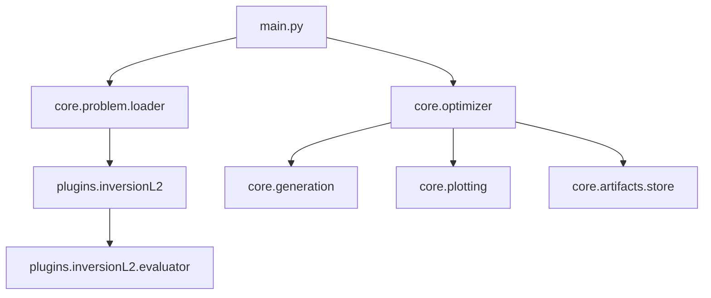

# Project Overview: ParetoMetaDecision

This project is a multi-objective optimization framework designed for "meta-decision" processes. It is currently implemented for financial investment strategies (order flow imbalance).

## Architecture

The system is highly modular, separating the optimization core from the domain-specific logic.

## Key Components

- **Core Optimizer**: Implements a two-phase optimization (grid/combinatorial followed by guided discovery). It finds the Pareto frontier of configurations based on multiple objectives (profit, risk, frequency).
- **Problem Abstraction**: Each problem (e.g., InversionL2) is loaded via a factory specified in a YAML domain file.
- **Decision Language (AST)**: Strategies are represented as trees of rules (Atoms) and combinators (AND, OR). This allows for complex, human-readable decision logic that can be audited.
- **InversionL2 Plugin**:
    - **Data Loading**: Processes high-frequency data (Level 2 order book).
    - **Feature Engineering**: Calculates order imbalance across top-k price levels.
    - **Strategy Evaluation**: Simulates trading signals, applying filters like time-grid schedules and trend gates.
    - **Metrics**: Computes profit (mean return), risk (standard deviation), and frequency (market exposure).

## Optimization Workflow

1. **Initialization**: Loads `domain.yaml` and builds the `Problem` and `Optimizer`.
2. **Phase 1 (Combinatorial)**: Explores a search space defined in YAML (e.g., grid search over parameters).
3. **Phase 2 (Guided Discovery)**: Refines the search around the best candidates using local search or evolutionary techniques.
4. **Pareto Evaluation**: Identifies configurations that offer the best trade-offs between objectives.
5. **Validation**: Re-evaluates the best configuration multiple times to ensure stability and determinism.
6. **Auditing**: Records per-second decision logs to `cache/audit/` for full transparency of why each trade was (or wasn't) made.

## Key Files
- `main.py`: Entry point and orchestration.
- `core/optimizer.py`: Optimization heart.
- `core/decision_language/ast.py`: Decision rule structure.
- `plugins/inversionL2/evaluator.py`: Strategy simulation and financial calculation.
